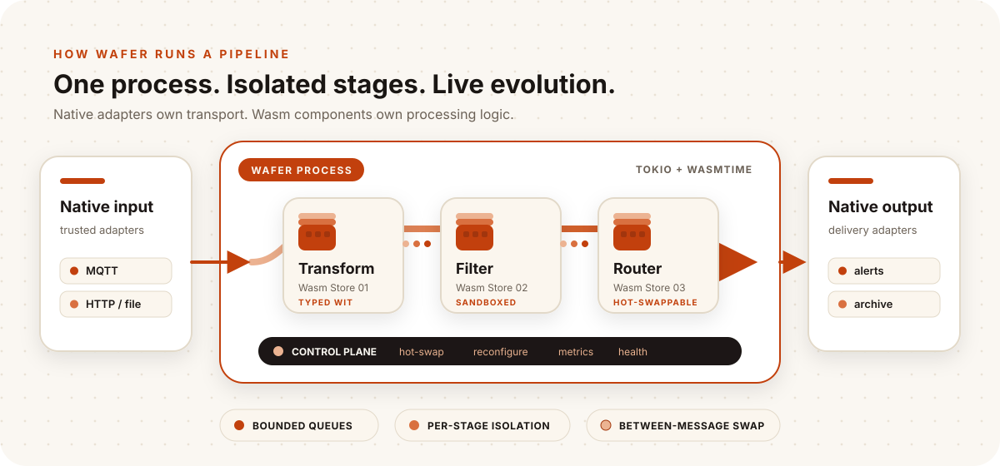

<p align="center">
  <picture>
    <source media="(prefers-color-scheme: dark)" srcset="brand/wafer-lockup-dark.svg">
    
  </picture>
</p>

<p align="center">
  A single-process runtime for typed, sandboxed data pipelines on edge gateways.
</p>

<p align="center">
  <a href="#run-a-pipeline">Run WAFER</a> ·
  <a href="docs/architecture/00-vision.md">Explore the architecture</a> ·
  <a href="docs/status/implementation-status.md">Project status</a>
</p>

WAFER executes directed acyclic graphs (DAGs) whose processing stages are
WebAssembly Component Model components. Native adapters handle ingress and
egress; bounded Tokio queues connect stages; each Wasm stage owns an isolated
Wasmtime Store and can be replaced between messages.

WAFER is part of an ongoing undergraduate research project. The runtime is
public now; the thesis and supporting research materials will be released
publicly soon.

> [!NOTE]
> WAFER is a research prototype. Final empirical conclusions remain pending the
> admitted Raspberry Pi 5 campaign. Current diagnostic and rehearsal results are
> not final thesis evidence.

## What WAFER does

<p align="center">
  
</p>

| Property | Current design |
| --- | --- |
| Typed plugins | One `wafer:pipeline@0.1.0` WIT package with Transform, Filter, Router, and capability-gated Inference worlds. |
| Fault containment | One Store and linear memory per Wasm node, with configurable fuel, epoch, memory, and capability limits. |
| Backpressure | One bounded receiver per destination; each incoming edge chooses `slow`, `drop`, or `dead-letter`. |
| Live replacement | Loaded Wasm processing nodes switch to a prepared instance between messages. Guest state is not migrated. |
| I/O boundary | Sources and sinks are native Rust adapters. Processing guests can receive exact-destination outbound `wasi:http` grants. |
| Deployment | One Linux process and one TOML pipeline definition; no Kubernetes or per-stage containers. |

WAFER does not provide distributed execution, stateful windows, exactly-once
semantics, or state migration between component versions.

## Run a pipeline

Prerequisites: [Rust via rustup](https://rustup.rs/),
[mise](https://mise.jdx.dev/), and a C toolchain.

```bash
git clone https://github.com/PedroKlein/wafer.git
cd wafer
mise trust
mise run setup
mise run //plugins:build-plugin uppercase
printf 'hello wafer\n' | mise run run examples/dag-uppercase.toml
# HELLO WAFER
```

The example loads this pipeline:

```toml
[nodes.source]
type = "source"
kind = "stdin"

[nodes.uppercase]
type = "transform"
plugin = "../plugins/uppercase/target/wasm32-wasip2/release/wafer_uppercase.wasm"

[nodes.sink]
type = "sink"
kind = "stdout"

[[edges]]
from = "source"
to = "uppercase"

[[edges]]
from = "uppercase"
to = "sink"
```

More runnable topologies are under [`examples/`](examples/), including MQTT,
HTTP, fan-out, dead-letter handling, metrics, OCI-hosted components, and the
secondary MNIST inference scenario.

## Observe and update a running pipeline

Start a pipeline without piping EOF into it and leave that terminal open:

```bash
mise run run examples/dag-uppercase.toml
```

The control plane listens on `127.0.0.1:9090` by default. From another terminal:

```bash
curl -s http://127.0.0.1:9090/health
curl -s http://127.0.0.1:9090/api/v1/nodes | jq
curl -s http://127.0.0.1:9090/metrics | head
```

A loaded Wasm Transform, Filter, or Router reports
`replacement_eligible: true`. Prepare another compatible component and replace
it without stopping the pipeline:

```bash
curl -X POST http://127.0.0.1:9090/api/v1/nodes/uppercase/hot-swap \
  -H 'content-type: application/json' \
  -d '{"wasm_path":"./path/to/replacement.component.wasm"}'
```

The response reports local replacement adoption and the first runner-local
outcome. It does not prove downstream delivery or zero loss; evaluation-owned
sink and sequence artifacts establish those claims.

## Repository map

| Path | Contents |
| --- | --- |
| [`crates/`](crates/) | Runtime, core engine, configuration, shared types, CLI, load generator, and guest SDK. |
| [`wit/`](wit/) | Project WIT package and pinned dependency interfaces. |
| [`plugins/`](plugins/) | Rust processing components, attack fixtures, and bounded language demonstrations. |
| [`examples/`](examples/) | Runnable pipeline configurations. |
| [`docs/`](docs/) | Architecture, interfaces, operations, decisions, status, and benchmark documentation. |
| [`eval/`](eval/) | Experiment definitions, result contract, execution tooling, and analysis. |
| [`brand/`](brand/) | WAFER mark and light/dark repository lockups. |

## Documentation

- [Getting started](docs/operations/getting-started.md)
- [Architecture overview](docs/architecture/00-vision.md)
- [Configuration reference](docs/interfaces/config-schema.md)
- [WIT contracts](docs/interfaces/wit-contracts.md)
- [Plugin SDK](docs/interfaces/plugin-sdk.md)
- [HTTP API](docs/interfaces/http-api.md)
- [Implementation status](docs/status/implementation-status.md)
- [ADRs](docs/adr/) and [RFCs](docs/rfcs/)
- [Source-guided learning path](docs/learn/README.md)

## Development

```bash
mise tasks ls --all
mise run build
mise run test
mise run fmt
mise run clippy
```

Rust is pinned in [`rust-toolchain.toml`](rust-toolchain.toml). Development
conventions and domain-specific guidance live in [`.agents/`](.agents/).

## License

WAFER is available under the [MIT License](LICENSE).
