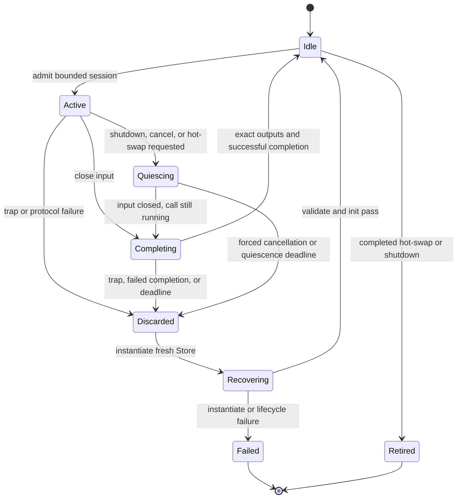

# ADR-0017: Experimental WASI P3 finite-stream lifecycle

- **Status:** Experimental, frozen for the P3 PoC
- **Scope:** `experiments/p3/` only
- **Production baseline:** `wafer:pipeline@0.1.0` on WASI P2 remains unchanged

## Context

The P3 candidate moves owned envelopes through native async functions and finite streams. That changes the lifetime boundary from one synchronous guest call to a suspended session. Before measuring it, WAFER needs one bounded rule for ownership, ordering, backpressure, disposition, cancellation, recovery, and hot-swap.

This decision does not make P3 production-ready. It defines the behavior that the isolated PoC must prove.

## Decision

A P3 stream session admits at most 32 envelopes. The host owns a 32-entry disposition ledger containing a cheap `RuntimeEnvelope` retention clone and the input ordinal. The guest owns each lowered envelope until it emits or drops it. The host does not release the retained entry until it assigns exactly one terminal disposition.

The message arm uses the same ledger with a one-element session. The production P2 arm continues to use the real bounded Tokio queue and `borrow<buffer>` call path.

### Ownership, copies, and drops

| Boundary | Ownership and allocation rule | Drop owner | Required counter |
| --- | --- | --- | --- |
| Production queue | `RuntimeEnvelope` moves through a capacity-32 Tokio MPSC queue; fan-out clones retain shared `Arc`/`Bytes` backing. | Receiver or terminal policy. | Queue moves are zero payload-copy events. |
| P2 input | Host retains `Bytes`; a call-scoped `borrow<buffer>` enters the Store table. `read-all` conservatively counts one payload-sized host-to-guest copy and guest allocation. | Host deletes the table resource after every completed call, including errors and traps. | One input copy/allocation per pass-through hop. |
| P2 output | Guest-owned `list<u8>` is lifted to a host buffer. | Host owns the lifted output. | One output copy/allocation per pass-through hop. |
| P3 input | Host lowers an owned `list<u8>` from the retained envelope. | Guest owns and drops an unreturned input list. | One host-to-guest payload copy and guest allocation per attempted hop. |
| P3 output | Guest returns an owned `list<u8>` which is lifted into host storage. | Host owns the lifted output. | One guest-to-host payload copy and host allocation per emitted hop. |
| Ledger | Host retains `Arc`/`Bytes` identity until disposition. This is not counted as a payload copy. | Host drops on terminal disposition. | One bounded ledger entry per admitted input. |
| Closed stream | Unwritten elements remain host-owned; accepted but unresolved elements remain represented in the ledger. | Endpoint owners drop unread transport values; host still disposes every ledger entry. | Unresolved count must reconcile to terminal dispositions. |

The PoC reports these conservative logical boundary counts. It does not infer physical zero-copy from an owned type or attempt to instrument Wasmtime internals.

### Ordering

- A single producer is FIFO by host admission ordinal.
- Fan-in preserves FIFO independently for each producer. Tokio MPSC provides no global cross-producer order.
- The host serializes accepted fan-in values into one session ordinal and associates each output item with the next unresolved ordinal.
- A successful output is publishable only after all earlier ordinals have a terminal disposition. Later successes may wait in the bounded ledger while an earlier input retries.
- An extra output, missing output, or output after completion is a protocol violation.
- The performance experiment uses one producer, so all three arms have one total FIFO order.

### Backpressure

All host queues have capacity 32. A stream session admits at most 32 inputs and holds at most 32 ledger entries. The writer waits for Component Model stream capacity before transferring the next element. The output consumer resolves ledger entries before requesting more output. There is no unbounded channel, side buffer, or detached producer.

Pressure propagates in this order:

```text
sink queue full
  -> output consumer stops requesting values
  -> Component Model output stream applies backpressure
  -> guest stops reading input
  -> Component Model input stream applies backpressure
  -> host stops receiving from the bounded Tokio queue
  -> upstream sender blocks
```

### Host-authoritative disposition

Every envelope accepted into the ledger receives exactly one terminal disposition: `forwarded`, `dead-lettered`, or `skipped`. The PoC fixes retry exhaustion to `dead-lettered`; it tests `skipped` only as an explicit shutdown discard policy and never silently drops an input.

| Outcome | Host action | Store action | Terminal disposition |
| --- | --- | --- | --- |
| Success | Validate every envelope field and ordinal, then send downstream in order. | Reuse after clean message/session completion. | `forwarded` |
| Typed `bad-input` | Do not retry. | Reuse after clean completion. | `dead-lettered:bad-input` |
| Typed `dependency-failed` or `processing-failed` | Retry the ordinal after the current finite session completes; increment `retry-count`; preserve later results in the bounded ledger. | Reuse because the guest returned normally. | Eventually `forwarded` or `dead-lettered:retries-exhausted` |
| Typed `timed-out` | Do not retry in this PoC. | Replace after session completion because timeout safety cannot be inferred from guest state. | `dead-lettered:timed-out` |
| Typed `unrecoverable` | Do not retry. | Replace after session completion. | `dead-lettered:unrecoverable` |
| Retry exhaustion | Emit one DLQ record with the final retry count. | Reuse only if every involved call completed normally. | `dead-lettered:retries-exhausted` |
| Wasmtime trap | Stop accepting input; dispose the Store; mark every unresolved ledger entry. | Fresh Store required before any later input. | `dead-lettered:session-trap` |
| Early output close, missing output, extra output, or failed completion future | Treat as protocol failure; dispose the Store; mark every unresolved ledger entry. | Fresh Store required. | `dead-lettered:protocol-failure` |
| Graceful shutdown | Stop admission, close input, run the active call/session to completion, commit resolved outputs, and flush retry entries. | Drop after completion; no reuse. | Resolved entries keep their disposition; unresolved entries become `dead-lettered:shutdown`. |
| Explicit cancellation before a call | Do not admit the envelope. | Existing Store is unchanged. | No disposition because the input was not accepted. |
| Explicit cancellation after admission | Stop admission. The normal path waits for completion. A cancellation-drop test may drop the guest future only when the Store is immediately discarded. | Fresh Store required after any dropped guest future. | Unresolved entries become `dead-lettered:cancelled`. |
| Hot-swap | Stop admission and close the finite input. Wait for completion until the bounded quiescence deadline. | On clean quiescence, drop old Store and adopt the prepared Store. On deadline, drop the active future and old Store before adoption. | Clean results retain their disposition; deadline-unresolved entries become `dead-lettered:hot-swap-discard`. |

DLQ unavailable/full is a failed lifecycle test, not a successful terminal disposition.

### Metering

Correctness tests use a 10,000,000-fuel and 100-epoch-tick budget per message attempt. A stream session receives the checked product of that budget and the number of admitted elements. Epoch ticks are 10 ms. Exhaustion is a trap, so the Store is discarded and all unresolved inputs receive `session-trap`.

The matched performance experiment disables fuel and epoch metering in all three arms. This keeps the control identical and avoids comparing per-call resets with a session-wide stream budget. Metered lifecycle results and unmetered performance results remain separate.

### Session completion and Store state

A finite stream session completes only when:

1. the host closed the input writer;
2. the output stream closed;
3. exactly one output item was observed for every admitted ordinal; and
4. the completion future resolved successfully.

Only then may the Store be reused. A trap, failed completion, protocol violation, or dropped call transitions directly to `Discarded`; a fresh Store must be instantiated and initialized before returning to `Idle`.



No transition from `Discarded` returns to `Active` or `Idle` with the same Store.

### Hot-swap quiescence

A replacement is prepared before signaling. A pending replacement never enters an active finite session. The runner closes the current input, drains outputs and completion, then switches between sessions. Outputs carry a version stamp in the conformance test; the sequence must contain one boundary and no interleaving.

The quiescence deadline is the same 60-second subprocess outer bound used by lifecycle tests. Expiry is destructive for the old session: drop its future and Store, disposition unresolved ledger entries as `hot-swap-discard`, then adopt the already-prepared fresh Store. The old Store is never resumed.

## ADR-to-test matrix

| ID | Behavior | Planned executable proof |
| --- | --- | --- |
| `C01` | Message and stream preserve every envelope field, duplicate metadata, retry count, and payload. | Full-sequence equality test for both P3 worlds. |
| `C02` | Single-producer FIFO and per-producer fan-in FIFO hold. | Two-producer stamped input test with per-producer monotonic assertions. |
| `C03` | Capacity 32 pressure stalls and resumes without loss or unbounded buffering. | Handshake test fills queue/session credits, proves producer pending, consumes one, and proves one-step progress. |
| `C04` | Logical payload copy/allocation counters reconcile by element, hop, and byte size. | Counter equations asserted for 120 B, 1 KiB, and 100 KiB. |
| `C05` | Typed guest errors receive one terminal disposition. | Error-variant table test checks DLQ reason and ledger cardinality. |
| `C06` | Retry succeeds in order or exhausts exactly once. | Retry fixture checks retry count, delayed later output, and one DLQ record on exhaustion. |
| `C07` | Trap discards the Store and dispositions unresolved inputs. | Timeout-bounded subprocess test compares Store identities before recovery. |
| `C08` | Early close, cardinality mismatch, and failed completion are protocol failures. | Three malformed-session subprocess fixtures check DLQ reconciliation and fresh Store. |
| `C09` | Graceful shutdown never drops an active guest future. | Barrier-controlled active call completes, then pending inputs receive shutdown dispositions. |
| `C10` | Explicit cancellation never reuses a cancellation-dropped Store. | Subprocess drops a suspended call, asserts old Store destruction, creates a fresh Store, and completes a new call. |
| `C11` | Hot-swap occurs at one quiescent version boundary. | Version-stamped drain test asserts no v1 output after the first v2 output. |
| `C12` | Hot-swap deadline discards the old Store and unresolved ledger entries. | Stalled-session subprocess test asserts deadline, discard dispositions, and fresh replacement identity. |
| `C13` | P3 HTTP suspends and resumes only for the exact loopback grant. | Existing request-level deny/allow test remains mandatory. |
| `C14` | Production P2 and maintained Go fixture remain unchanged. | Root diff, P2 feature tree, mandatory P2 tests, and TinyGo five-test receipt. |
| `E01` | Six counterbalanced triplets exist for all six primary conditions. | Contract validator checks 36 triplets, 108 leaves, and balanced arm positions. |
| `E02` | Missing, malformed, dirty, unpaired, lossy, duplicate, or unreconciled leaves fail closed. | Raw-manifest validator negative fixtures. |
| `E03` | Setup and steady state are separate. | Raw schema requires compile/instantiate fields outside steady-state metrics. |
| `E04` | Decision formulas produce exactly one outcome. | Decision validator exhaustively checks gate combinations and threshold boundaries. |

Every row is resolved to a named future test. P2-T2 must not remove or weaken a row; a design mismatch requires a recorded divergence.

## Three-arm experiment

The machine-readable authority is `experiments/p3/experiment-contract.json`. It freezes:

- arms: production P2, P3 message-at-a-time, and P3 finite stream;
- payloads: 120 B, 1 KiB, and 100 KiB of `0x42`;
- depths: one and five pass-through transforms;
- six counterbalanced matched triplets for every payload/depth condition;
- capacity 32, two Tokio workers, 256 warmup and 2,048 measured messages;
- release locked builds with metering disabled identically in all performance arms;
- separate compilation, instantiation, and steady-state measurements; and
- a 60-second process-group outer timeout for every leaf.

`experiments/p3/dry-run-schedule.json` expands this to 36 triplets and 108 ordered leaves. Raw leaves conform to `experiments/p3/raw-leaf-schema.json`; the final result conforms to `experiments/p3/decision-schema.json`.

For each arm and condition, throughput and each latency percentile are the median of six run values. Peak RSS is the maximum of six run peaks. Payload conditions are never pooled.

```text
throughput_delta_pct = 100 * (candidate_throughput - p2_throughput) / p2_throughput
p95_delta_pct = 100 * (candidate_p95_ns - p2_p95_ns) / p2_p95_ns
rss_delta_bytes = candidate_peak_rss_bytes - p2_peak_rss_bytes
rss_allowance_bytes = max(0.05 * p2_peak_rss_bytes, 2,097,152)
stream_throughput_benefit_pct = throughput_delta_pct
stream_p95_benefit_pct = -p95_delta_pct
```

P3 message must have throughput delta at least -5%, p95 delta at most +5%, and RSS delta within the allowance in every condition. P3 stream has the same regression budgets in every condition and must additionally improve throughput by at least 10% or p95 by at least 10% in the predeclared `100kb-depth5` condition.

## Fail-closed decision

Decision precedence is mutually exclusive:

1. Any failed host, guest, maintained-language, or embedder production-readiness toolchain gate selects `defer-p3-toolchain`.
2. Otherwise, every semantic, provenance, pairing, message-regression, stream-regression, and stream-benefit gate passing selects `migrate-wit-before-release`.
3. Otherwise select `retain-p2-for-v1`.

There is no inconclusive or partial-adoption state. P1-T4's `go-p3-blocked` result is a toolchain failure, so it already prevents migration; later measurements remain useful diagnostic evidence and cannot override this gate.

## Consequences

The model pays for a bounded host ledger and delays later outputs behind retries. That is intentional: it preserves host-authoritative accounting and FIFO without inventing an unbounded reorder buffer. Stream sessions amortize the call boundary only across at most 32 elements. Larger or adaptive sessions, same-instance concurrency, Filter/Router worlds, and production migration remain out of scope.
