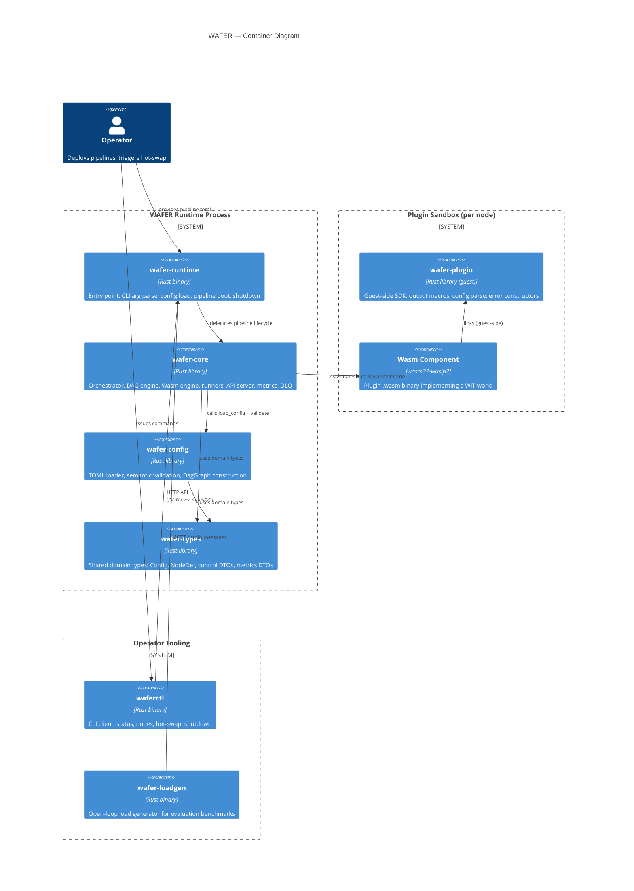
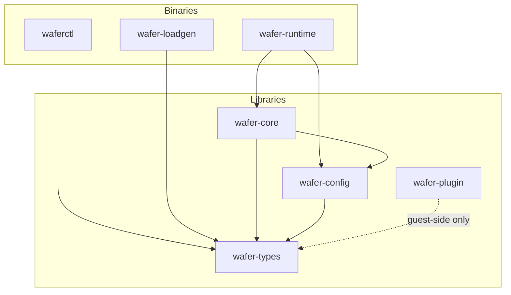
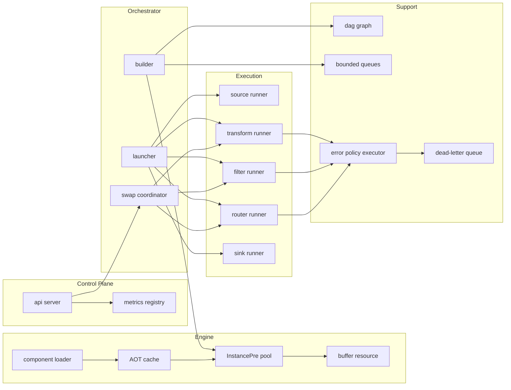

# 03 — Building Blocks

> arc42 §5 — Static decomposition into crates, modules, and their responsibilities.

## System overview

WAFER ships as a Cargo workspace of seven crates. Four are libraries consumed
internally; three are standalone binaries. The diagram below shows the
container-level view (C4 Level 2).

## Crate dependency graph

At the Cargo level, the dependency DAG flows downward:

`wafer-plugin` is a path dependency used by plugin crates compiled to
`wasm32-wasip2`. It never links into the host process.

---

## Crate responsibilities

### `wafer-types`

The leaf library. Contains every shared type that crosses crate boundaries:

- **Config domain** — `Config`, `NodeDef`, `NodeCategory`, `WasmNodeDef`,
  `EdgeDef`, `EngineConfig`, `ErrorPolicyConfig`, source/sink configs.
- **Control plane DTOs** — `PipelineState`, `NodeState`, `NodeInfo`,
  `HotSwapResult`, `ControlError`, `ErrorResponse`.
- **Events** — `PipelineEvent` broadcast enum.
- **Metrics DTOs** — snapshot structs consumed by the Prometheus scrape path.

No runtime logic, no IO, no async. Pure `#[derive(Serialize, Deserialize)]`
structures with `Display` impls.

### `wafer-config`

Stateless library that turns raw TOML bytes into a validated, graph-ready
representation:

1. `load_config` — deserialise TOML into `Config` (via `wafer-types`).
2. `validate` — semantic checks: unique node IDs, edge endpoints exist,
   router port declarations match edges, cycle detection via topological
   sort. Accumulates `ValidationError` variants.
3. `DagGraph` — petgraph `DiGraph` built from the validated config, used
   by the orchestrator to determine execution order and wiring.

### `wafer-core`

The largest crate. Contains all runtime logic grouped into modules:

| Module | Responsibility |
|--------|---------------|
| `engine` | Wasmtime lifecycle: component loading, AOT cache (blake3-keyed), `InstancePre` pooling, `WaferBuffer` resource, WASI capability scoping, `StoreLimits`, WIT bindgen glue, host function impls (`pipeline:host/logging`). |
| `orchestrator` | Pipeline lifecycle: `Pipeline` handle, `builder` (task-per-node construction, mpsc wiring, watch-channel per Wasm node), `launcher` (JoinSet startup), `hotswap` (`SwapCoordinator`, `SwapTimeline`). |
| `runner` | Per-category async loops — one each for source, sink, transform, filter, router. Each loop owns its `Store`, receives from mpsc, sends to downstream mpsc, and integrates with the error policy executor. |
| `dag` | Petgraph wrapper: `DagGraph`, topological sort, cycle rejection. |
| `queue` | `bounded.rs` (thin tokio::mpsc wrapper), `envelope.rs` (`RuntimeEnvelope` with `Arc<EnvelopeHeader>` + `Bytes` payload + `Lineage`). |
| `node` | Abstractions: `ProcessNode` trait, `NodeState` FSM, native vs Wasm implementations, per-node metrics. |
| `dlq` | Dead-letter queue writer — routes `DlqEnvelope` to the configured MQTT topic or file. |
| `metrics` | `MetricsRegistry`, atomic counters on the hot path, Prometheus snapshot builder for the scrape endpoint. |
| `bench` | Measurement helpers: per-hop HdrHistogram tap, memory sampler. |
| `config` | Runtime-internal config wiring: schema introspection, hot-swap diff computation. |
| `testing` | `TestPipeline` harness shared by unit tests, integration tests, and benchmarks. |
| `api` | Axum HTTP server: route wiring, handlers (health, ready, list-nodes, get-node, hot-swap, shutdown, metrics scrape). |
| `error` | `WaferError`, `RegistryError`, top-level `Result` alias. |

### `wafer-plugin`

Guest-side SDK compiled to `wasm32-wasip2` and linked into every plugin
binary. Provides:

- `output_from!` / `output_with_type!` macros for constructing `output-message`.
- `parse_config` — JSON string → typed struct via serde.
- Five error constructors matching `pipeline:types.process-error` variants.
- Thread-local state helpers (`RefCell`-based) for stateful plugins.

No proc macros, no networking, no filesystem. Plugins declare it as a
workspace path dependency in their `Cargo.toml`.

### `wafer-runtime`

Single-file binary (`main.rs`). Performs four things in sequence:

1. Parse CLI arguments (config path, optional overrides).
2. Load and validate the pipeline TOML via `wafer-config`.
3. Build and launch the pipeline via `wafer_core::orchestrator::Pipeline`.
4. Start the axum control plane and block until shutdown signal (SIGINT or
   API-triggered cancel).

### `waferctl`

CLI client for the running control plane. Built with `clap` derive API
and dual-output formatting (human-readable tables via `tabled`, machine-
parseable JSON via `--json`). Subcommands map 1:1 to the HTTP API:

- `status` → `GET /health` + `GET /ready`.
- `nodes` → `GET /api/v1/nodes`.
- `hot-swap <id> <path>` → `POST /api/v1/nodes/{id}/hot-swap`.
- `shutdown` → `POST /api/v1/pipeline/shutdown`.

Error responses follow RFC 9457 Problem Details.

### `wafer-loadgen`

Open-loop load generator for the evaluation harness. Reads a rate schedule
(messages/sec over time) and a payload template, emits messages at the
configured rate to the pipeline's source (MQTT or stdin), records end-to-end
latencies with HdrHistogram, and writes results to CSV / `.hgrm` files.
Used exclusively during benchmarking — not part of production deployment.

---

## Component-level detail (inside `wafer-core`)

## Cross-cutting concerns

| Concern | Where it lives |
|---------|---------------|
| Observability | `metrics` module (counters), `api::metrics` (scrape), `tracing` spans emitted from every runner loop and host function. |
| Error handling | Stratified: `thiserror` in library boundaries, five-category WIT `process-error` at the guest–host edge, `anyhow` only in binaries. |
| Backpressure | Bounded `tokio::mpsc` channels on every edge; overflow policy configurable per-edge (slow / drop / dead-letter). |
| Isolation | One `wasmtime::Store` per Wasm node, per-node `StoreLimits`, epoch-based preemption, WASI capability scoping. |
| Hot-swap | Watch-channel signal from orchestrator → runner; between-messages replacement of `Store` + `Instance`. See [ADR-0012](../adr/0012-watch-channel-hot-swap.md). |

## Related documents

- [01 — Goals and Constraints](./01-goals-and-constraints.md)
- [04 — Runtime View](./04-runtime-view.md) — sequence-level execution
- [RFC-001 — WIT Contracts](../rfcs/RFC-001-wit-contracts.md)
- [RFC-002 — Host Runtime](../rfcs/RFC-002-host-runtime.md)
- [ADR-0006 — Cargo Workspace](../adr/0006-workspace-architecture.md)
