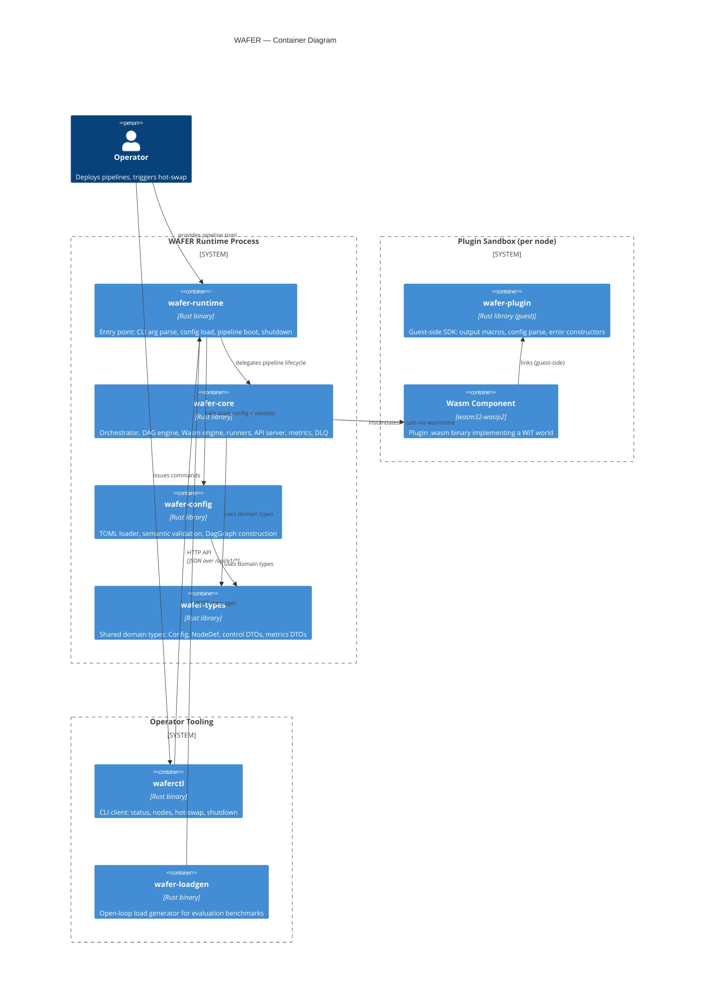
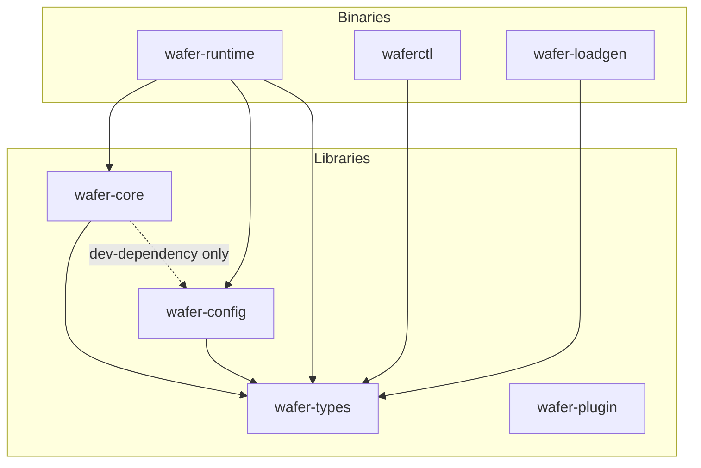
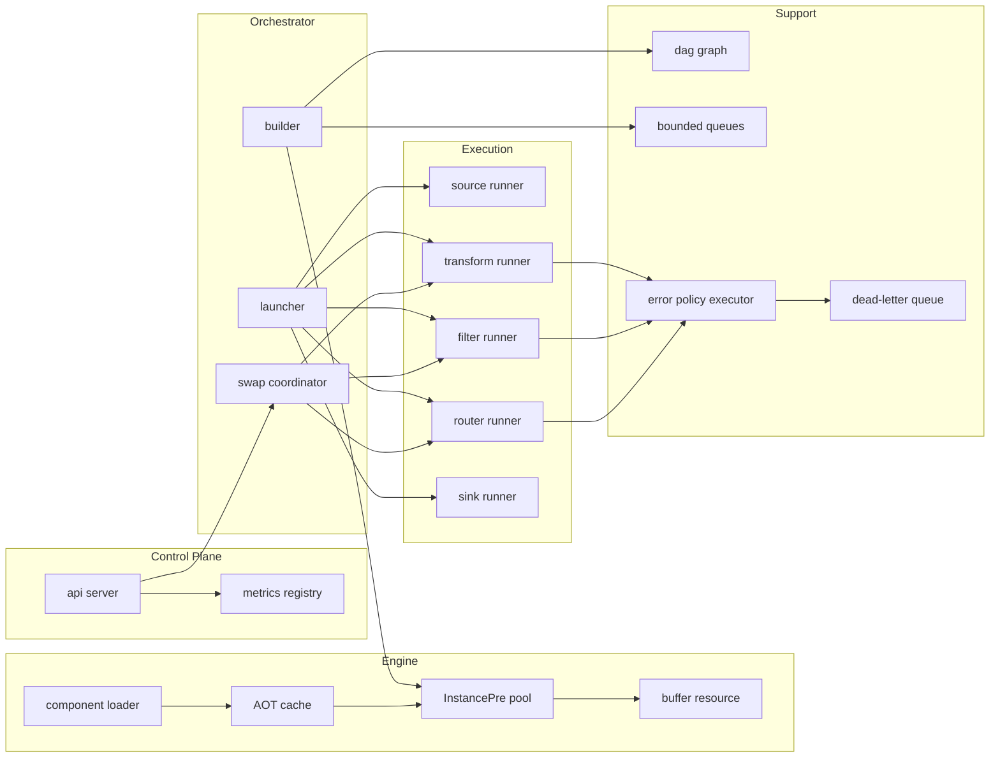

# 03 — Building Blocks

> arc42 §5 — Static decomposition into crates, modules, and their responsibilities.

## System overview

WAFER ships as a Cargo workspace of seven crates. Four are libraries consumed
internally; three are standalone binaries. The diagram below shows the
container-level view (C4 Level 2).

```mermaid
C4Container
    title WAFER — Container Diagram

    Person(operator, "Operator", "Deploys pipelines, triggers hot-swap")

    System_Boundary(wafer, "WAFER Runtime Process") {
        Container(runtime, "wafer-runtime", "Rust binary", "Entry point: CLI arg parse, config load, pipeline boot, shutdown")
        Container(core, "wafer-core", "Rust library", "Orchestrator, DAG engine, Wasm engine, runners, API server, metrics, DLQ")
        Container(config, "wafer-config", "Rust library", "TOML loader, semantic validation, DagGraph construction")
        Container(types, "wafer-types", "Rust library", "Shared domain types: Config, NodeDef, control DTOs, metrics DTOs")
    }

    System_Boundary(plugins, "Plugin Sandbox (per node)") {
        Container(plugin_sdk, "wafer-plugin", "Rust library (guest)", "Guest-side SDK: output macros, config parse, error constructors")
        Container(wasm_component, "Wasm Component", "wasm32-wasip2", "Plugin .wasm binary implementing a WIT world")
    }

    System_Boundary(tooling, "Operator Tooling") {
        Container(ctl, "waferctl", "Rust binary", "CLI client: status, nodes, hot-swap, shutdown")
        Container(loadgen, "wafer-loadgen", "Rust binary", "Open-loop load generator for evaluation benchmarks")
    }

    Rel(operator, ctl, "issues commands")
    Rel(ctl, runtime, "HTTP API", "JSON over /api/v1/*")
    Rel(operator, runtime, "provides pipeline.toml")
    Rel(runtime, core, "delegates pipeline lifecycle")
    Rel(runtime, config, "calls load_config + validate")
    Rel(core, types, "uses domain types")
    Rel(config, types, "uses domain types")
    Rel(core, wasm_component, "instantiates + calls via wasmtime")
    Rel(wasm_component, plugin_sdk, "links (guest-side)")
    Rel(loadgen, runtime, "MQTT messages")
```

## Crate dependency graph

At the Cargo level, the dependency DAG flows downward:

```mermaid
flowchart TD
    subgraph Binaries
        RT[wafer-runtime]
        CTL[waferctl]
        LG[wafer-loadgen]
    end

    subgraph Libraries
        CORE[wafer-core]
        CFG[wafer-config]
        TYPES[wafer-types]
        PLUGIN[wafer-plugin]
    end

    RT --> CORE
    RT --> CFG
    RT --> TYPES
    CTL --> TYPES
    LG --> TYPES
    CORE --> TYPES
    CFG --> TYPES
    CORE -.->|"dev-dependency only"| CFG
```

`wafer-core` uses `wafer-config` only in its tests; production graph
construction uses the core crate's own `DagGraph`. `wafer-plugin` has no
workspace dependencies (only optional `serde` / `serde_json`), so the
`wasm32-wasip2` guest build does not pull in host crates. It is a path
dependency of plugin crates and never links into the host process.

---

## Crate responsibilities

### `wafer-types`

The leaf library. Contains every shared type that crosses crate boundaries:

- **Config domain** — `Config`, `NodeDef`, `NodeCategory`, `WasmNodeDef`,
  `EdgeDef`, `EngineConfig`, `ErrorPolicyConfig`, source/sink configs.
- **Control plane DTOs** — `PipelineState`, `NodeState`, `NodeInfo`,
  `HotSwapResult`, `ControlError`, `ErrorResponse`.
- **Events** — `PipelineEvent` broadcast enum.
- **Metrics DTOs** — snapshot structs consumed by the Prometheus scrape path.

No runtime logic, no IO, no async. Pure `#[derive(Serialize, Deserialize)]`
structures with `Display` impls.

### `wafer-config`

Stateless library that turns raw TOML bytes into a validated, graph-ready
representation:

1. `load_config` — deserialise TOML into `Config` (via `wafer-types`).
   Unknown keys are rejected everywhere except inside a plugin's opaque
   `config` table.
2. `validate` — semantic checks: edge endpoints exist, source/sink
   direction, router edges carry a `port` and non-router edges do not, no
   duplicate edges, every processing node has an input and an output,
   `[dead_letter]` present when an edge uses `overflow = "dead-letter"` or
   a node's error policy sends to `dlq`, non-zero queue capacities and `epoch_tick_ms`, orphan and cycle
   detection. Accumulates `ValidationError` values.
3. `DagGraph` — a petgraph `DiGraph` built from the config. The runtime
   orchestrator does not use this type; `wafer-core` builds its own
   `dag::graph::DagGraph` and re-checks the structure.

### `wafer-core`

The largest crate. Contains all runtime logic grouped into modules:

| Module | Responsibility |
|--------|---------------|
| `engine` | Wasmtime lifecycle: component loading, AOT cache (blake3-keyed), `InstancePre` pooling, asynchronous P2 bindings, `WaferBuffer` resources, WASI capability scoping, exact-destination outbound HTTP enforcement, `StoreLimits`, and host logging. |
| `orchestrator` | Pipeline lifecycle: `Pipeline` handle, receiver-keyed mpsc wiring, loaded-Wasm replacement eligibility, per-node mutation guards, JoinSet startup, and replacement preparation. |
| `runner` | Per-category async loops — one each for source, sink, transform, filter, router. Each loop owns its `Store`, receives from mpsc, sends to downstream mpsc, and integrates with the error policy executor. |
| `dag` | Petgraph wrapper: `DagGraph`, topological sort, cycle rejection. |
| `queue` | `bounded.rs` tracking wrappers and `envelope.rs` (`RuntimeEnvelope` with `Arc<EnvelopeHeader>`, `Bytes` payload, `Lineage`, and host retry count). |
| `node` | Abstractions: `ProcessNode` trait, `NodeState` FSM, native vs Wasm implementations, per-node metrics. |
| `dlq` | Dead-letter queue writer — routes `DlqEnvelope` to the configured MQTT topic or file. |
| `metrics` | Hot-swap phase and recovery histograms (`HotSwapMetrics`). `GET /metrics` is rendered in `api` from per-node `NodeMetrics` counters and those histograms. `MetricsRegistry` and its snapshot builder are not wired into the runtime, so families such as `wafer_queue_depth` do not appear on the live endpoint. |
| `bench` | Measurement helpers: `MemoryRecorder` (RSS from `/proc/self/statm`) and `QueueDepthRecorder`, which writes `queue-depth.csv` when `WAFER_QUEUE_DEPTH_OUTPUT` is set. |
| `config` | Re-exports the shared `wafer-types` configuration surface for core consumers. |
| `testing` | In-memory `ChannelSource` / `ChannelSink` I/O and `PluginTestHarness` / `TransformHarness` for direct component calls; compiled for tests and benches or with the `test-support` feature. |
| `api` | Axum HTTP server: route wiring, handlers (health, ready, list-nodes, get-node, hot-swap, reconfigure, shutdown, metrics scrape). |
| `error` | `WaferError`, `RegistryError`, top-level `Result` alias. |
| `registry` | OCI reference parsing, pulls and the tag-keyed plugin cache (24 h default TTL). |
| `util` | Small shared helpers (time conversion, file writes). |

### `wafer-plugin`

Guest-side SDK compiled to `wasm32-wasip2` and linked into every plugin
binary. Provides:

- `output_from!` / `output_with_type!` macros for constructing `output-message`.
- `parse_config` — JSON string → typed struct via serde.
- `payload_bytes!` / `payload_as_str!` payload readers and `log_info!` / `log_warn!` / `log_error!` logging macros.
- Five error constructors matching the `process-error` variants of `wafer:pipeline/types`.
- Thread-local state helpers (`RefCell`-based) for stateful plugins. This state lives in the guest instance and is reset whenever the host replaces the instance (hot-swap, recovery, rollback).

The SDK provides no proc macros, networking abstraction, or filesystem abstraction. Plugins declare it as a workspace path dependency in their `Cargo.toml`. A component may import P2 `wasi:http` directly when its node receives an explicit `outbound_http` grant; the SDK does not wrap that interface.

### `wafer-runtime`

Binary `wafer` (`main.rs`, plus `startup.rs` and `metadata.rs` for evaluation artifacts). Performs four things in sequence:

1. Parse CLI arguments (config path, optional overrides).
2. Load and validate the pipeline TOML via `wafer-config`.
3. Build and launch the pipeline via `wafer_core::orchestrator::Pipeline`.
4. Start the axum control plane and block until the pipeline completes or a
   shutdown signal arrives (SIGINT, SIGTERM, or API-triggered cancel). A
   failed run exits non-zero.

### `waferctl`

CLI client for the running control plane. Built with `clap` derive API
and dual-output formatting (human-readable tables via `tabled`, machine-
parseable JSON via `--json`). Subcommands call the HTTP API:

- `health` → `GET /health`.
- `status` → `GET /ready` + `GET /api/v1/nodes`.
- `nodes` → `GET /api/v1/nodes`.
- `node <id>` → `GET /api/v1/nodes/{id}`.
- `hot-swap <node-id> --wasm-path <path>` → `POST /api/v1/nodes/{id}/hot-swap`.
- `shutdown` → `POST /api/v1/pipeline/shutdown`.
- `metrics --raw` → `GET /metrics`. Without `--raw`, `metrics` calls no endpoint and prints an empty default snapshot.

`reload` and `drain` exist but exit with an error, because the runtime exposes no such endpoints; `config` manages local endpoint settings.

The server also exposes `POST /api/v1/nodes/{id}/reconfigure`; the current CLI has no reconfigure subcommand. Handler errors are plain text, not RFC 9457 Problem Details.

### `wafer-loadgen`

Open-loop load generator for the evaluation harness. Reads a rate schedule
(messages/sec over time) and a payload template, publishes to the pipeline's
MQTT source at the configured rate profile, subscribes to its MQTT sink,
records end-to-end latency with HdrHistogram, and writes `latency.hdr`,
`sequence.csv` and JSON summaries.
Used exclusively during benchmarking — not part of production deployment.

---

## Component-level detail (inside `wafer-core`)

```mermaid
flowchart LR
    subgraph Control Plane
        API[api server]
        METRICS[metrics registry]
    end

    subgraph Orchestrator
        BUILDER[builder]
        LAUNCHER[launcher]
        HOTSWAP[swap coordinator]
    end

    subgraph Execution
        SRC[source runner]
        TFM[transform runner]
        FLT[filter runner]
        RTR[router runner]
        SNK[sink runner]
    end

    subgraph Engine
        LOADER[component loader]
        CACHE[AOT cache]
        INST[InstancePre pool]
        BUF[buffer resource]
    end

    subgraph Support
        DAG[dag graph]
        QUEUE[bounded queues]
        DLQ[dead-letter queue]
        EPOL[error policy executor]
    end

    API --> HOTSWAP
    API --> METRICS
    BUILDER --> DAG
    BUILDER --> QUEUE
    BUILDER --> INST
    LAUNCHER --> SRC & TFM & FLT & RTR & SNK
    HOTSWAP --> TFM & FLT & RTR
    TFM --> EPOL
    FLT --> EPOL
    RTR --> EPOL
    EPOL --> DLQ
    LOADER --> CACHE
    CACHE --> INST
    INST --> BUF
```

## Cross-cutting concerns

| Concern | Where it lives |
|---------|---------------|
| Observability | `metrics` module (counters), `api::metrics` (scrape), `tracing` spans emitted from every runner loop and host function. |
| Error handling | Stratified: `thiserror` in library boundaries, five-category WIT `process-error` at the guest–host edge, `anyhow` only in binaries. |
| Backpressure | Bounded `tokio::mpsc` channels on every edge; overflow policy configurable per-edge (slow / drop / dead-letter). |
| Isolation | One `wasmtime::Store` per Wasm node, per-node `StoreLimits` (linear memory and tables; host-side WASI resources are not bounded), optional fuel/epoch bounds on Wasm CPU time (not on time blocked in a host import), and deny-by-default WASI capability scoping. Only a granted Wasm Transform receives the inference linker and ONNX backend; Wasm processing nodes receive network authority only through exact-destination `outbound_http` grants. |
| Hot-swap | Watch-channel signal from orchestrator → runner; between-messages replacement of `Store` + `Instance`. See [ADR-0012](../adr/0012-watch-channel-hot-swap.md). |

## Related documents

- [01 — Goals and Constraints](./01-goals-and-constraints.md)
- [04 — Runtime View](./04-runtime-view.md) — sequence-level execution
- [RFC-001 — WIT Contracts](../rfcs/RFC-001-wit-contracts.md)
- [RFC-002 — Host Runtime](../rfcs/RFC-002-host-runtime.md)
- [ADR-0006 — Cargo Workspace](../adr/0006-workspace-architecture.md)
