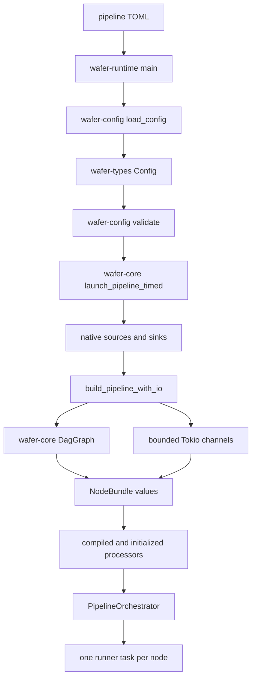

# Configuration to running pipeline

> **Documentation type:** Tutorial
>
> **Prerequisites:** [Learning guide orientation](README.md), [workspace and ownership map](workspace-map.md), and basic familiarity with [Result](rust-in-context.md#result), [ownership](rust-in-context.md#ownership), and a [bounded channel](rust-in-context.md#bounded-channel).

## Purpose

This walkthrough follows one pipeline configuration from a TOML path supplied to the `wafer` binary to the Tokio tasks that run its nodes. The goal is to locate each ownership boundary, not to catalogue every configuration field.

Keep two graph types separate while reading. `wafer-config::DagGraph` is the standalone graph exported by the configuration crate. The production builder constructs `wafer-core::dag::graph::DagGraph`; this is distinct from the standalone `wafer-config::DagGraph`.

## Flow

### 1. Load bytes into the shared model

`wafer-runtime/src/main.rs::main` receives the path from `--config` and calls `wafer_config::load_config`. The loader reads the file and passes its text to `toml::from_str`, producing `wafer_types::config::Config` or a `ConfigError`.

Loading is deliberately narrower than validation. A TOML document can deserialize successfully and still contain unknown edge endpoints, an orphan node, a cycle, or an invalid source/sink direction.

### 2. Accumulate semantic validation errors

`main` next calls `wafer_config::validate(&config)`. The validator runs its checks into one `Vec<ValidationError>` and returns all discovered failures together. The runtime converts that vector into an `anyhow` error before any engine, adapter, queue, or runner task is created.

The evaluation-config test walks every checked-in `eval/configs/*.toml`, calls both `load_config` and `validate`, and also requires a source, sink, and edge. It protects the process entry contract rather than proving that every external service is available.

### 3. Enter the core launcher

After successful validation, `main` clones the typed configuration into `launch_pipeline_timed`. The launcher:

1. creates the Wasmtime engine and registry;
2. creates native source and sink trait objects from their typed variants;
3. calls `build_pipeline_with_io` to construct topology and control state;
4. resolves, compiles, instantiates, validates, and initializes transform, filter, and router implementations;
5. inserts those processing nodes into their bundles;
6. passes the completed `BuildOutput` to `PipelineOrchestrator::from_build_output`.

The builder and launcher are separate because topology wiring does not need to own plugin compilation. Tests can therefore provide `ChannelSource` and `ChannelSink` implementations while exercising the same queue wiring used by production.

### 4. Construct the production DAG and queues

`build_pipeline_inner` calls `wafer-core::dag::graph::DagGraph::from_config`. That constructor independently rejects an empty graph, unknown endpoints, and cycles, then retains a topological ordering for structural queries.

This is a second defensive boundary after `wafer_config::validate`, not a production dependency on `wafer-config::DagGraph`. The `wafer-core` manifest lists `wafer-config` only under development dependencies.

`wire_queues` groups edges by destination. It creates one bounded `mpsc::channel(capacity)` for each destination node and clones its sender for every inbound edge. This gives fan-in one receiver and multiple producers. If inbound edges declare different capacities, the largest declared capacity wins; otherwise the engine default is used.

For every configured node, the builder moves its receiver, downstream senders, child cancellation token, state tracker, metrics, and type-specific implementation slot into a `NodeBundle`. Processing bundles also receive a watch channel and an `ErrorPolicyExecutor`.

### 5. Move bundles into tasks

`PipelineOrchestrator::from_build_output` owns the shared cancellation token, `JoinSet`, control handles, metrics, graph, and configuration. It first spawns the optional DLQ sink, then calls `spawn_bundles`.

`spawn_bundles` consumes every bundle. Source and sink tasks initialize their native adapters before entering their loops. Transform, filter, and router bundles with loaded implementations enter their respective processing loops. The result returned by `launch_pipeline_timed` is already running, which is why `main` can report the task count immediately after `into_parts`.

## Rust

### `Result` and `?` keep startup linear

Each startup layer returns its own error type until the runtime adds process-level context. `?` exits the current function without partially continuing startup. The runtime performs semantic validation before it transfers configuration ownership into the asynchronous launcher.

### Ownership makes task boundaries visible

The launcher owns the `Config`. The builder borrows it while constructing topology, then returns owned bundles. `spawn_bundles` moves each bundle into one `async move` task. A receiver therefore has one owning node task, while cloned senders can be held by multiple upstream tasks.

### `Arc` shares control state, not node-local mutation

Metrics, state trackers, the engine, and control-plane snapshots use `Arc` because the orchestrator and tasks need shared ownership. A processing node and its Wasmtime `Store` move into one runner task instead of being shared behind a lock on the message path.

### Bounded channels encode backpressure

A Tokio `mpsc` capacity is finite. Downstream send code awaits a permit before sending, so a full queue slows its producer rather than allocating without bound.

## Design

The startup seam is intentionally staged:

- `wafer-types` defines the model;
- `wafer-config` interprets and validates operator input;
- `wafer-core` builds the production graph, queues, adapters, processors, and tasks;
- `wafer-runtime` supplies process concerns such as CLI arguments, logging, signals, and control-plane servers.

This separation makes the core builder reusable in tests and keeps file I/O out of the queue and task constructors.

### Why validate twice?

The configuration validator gives operators broad, accumulated diagnostics. The core graph constructor protects the execution library even when another caller supplies a `Config` without first invoking `wafer_config::validate`. The overlap is a defensive API boundary, not evidence that the two `DagGraph` types are interchangeable.

### Queue-policy limit

**Known drift:** `EdgeSender` stores each configured overflow policy, but `QueueWiring::collect_downstream_senders` converts it to `DownstreamSender` without carrying that field. The current `send_one` path awaits capacity. Configured `Drop` and `DeadLetter` edge behavior is therefore not dispatched on that path.

## Status boundaries

**Current implementation:** Runtime startup calls `load_config`, then `validate`, then `launch_pipeline_timed`. The production builder creates `wafer-core::dag::graph::DagGraph`, destination-keyed bounded channels, node bundles, and a running `PipelineOrchestrator`.

**Intended design:** The duplicate structural check lets `wafer-core` defend its own public construction boundary even when it is called outside the runtime binary.

**Known drift:** `wafer-config::DagGraph` remains a separate public graph implementation, while production orchestration uses the core graph. Edge overflow metadata is not carried into `DownstreamSender`, so current downstream sending applies bounded backpressure rather than configured drop or dead-letter dispatch.

## Evidence

- **Source:** [`crates/wafer-runtime/src/main.rs`](../../crates/wafer-runtime/src/main.rs) | symbols: `let config = load_config`, `validate(&config)`, `launch_pipeline_timed`
- **Source:** [`crates/wafer-config/src/loader.rs`](../../crates/wafer-config/src/loader.rs) | symbols: `pub fn load_config`, `toml::from_str`
- **Source:** [`crates/wafer-config/src/validation.rs`](../../crates/wafer-config/src/validation.rs) | symbols: `pub fn validate`, `check_no_cycles`
- **Source:** [`crates/wafer-core/src/dag/graph.rs`](../../crates/wafer-core/src/dag/graph.rs) | symbols: `pub struct DagGraph`, `pub fn from_config`, `pub fn topo_order`
- **Source:** [`crates/wafer-core/src/orchestrator/builder.rs`](../../crates/wafer-core/src/orchestrator/builder.rs) | symbols: `use crate::dag::graph::DagGraph`, `fn wire_queues`, `mpsc::channel(capacity)`
- **Source:** [`crates/wafer-core/Cargo.toml`](../../crates/wafer-core/Cargo.toml) | symbols: `[dev-dependencies]`, `wafer-config = { path = "../wafer-config" }`
- **Source:** [`crates/wafer-core/src/orchestrator/launcher.rs`](../../crates/wafer-core/src/orchestrator/launcher.rs) | symbols: `pub async fn launch_pipeline_timed`, `build_pipeline_with_io`
- **Source:** [`crates/wafer-core/src/orchestrator/pipeline.rs`](../../crates/wafer-core/src/orchestrator/pipeline.rs) | symbols: `pub fn from_build_output`, `fn spawn_bundles`
- **Test:** [`crates/wafer-config/tests/eval_configs_load.rs`](../../crates/wafer-config/tests/eval_configs_load.rs) | symbol: `fn every_eval_config_loads_and_validates()`
- **Test:** [`crates/wafer-core/src/orchestrator/pipeline.rs`](../../crates/wafer-core/src/orchestrator/pipeline.rs) | symbol: `async fn test_spawn_creates_tasks()`

## Checkpoint

Starting at `main`, name the function that owns each transition: TOML to `Config`, semantic checks, production graph creation, queue creation, bundle-to-task movement. Then explain why the two `DagGraph` types must not be treated as one call path.
