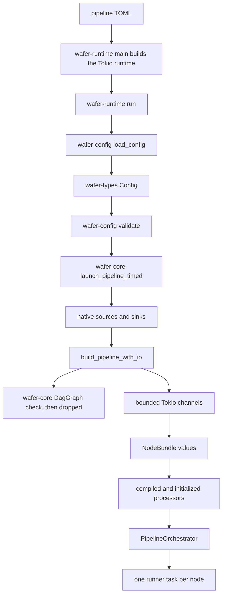

# Configuration to running pipeline

> **Documentation type:** Tutorial
>
> **Prerequisites:** [Learning guide orientation](README.md), [workspace and ownership map](workspace-map.md), and basic familiarity with [Result](rust-in-context.md#result), [ownership](rust-in-context.md#ownership), and a [bounded channel](rust-in-context.md#bounded-channel).

## Purpose

This walkthrough follows one pipeline configuration from a TOML path supplied to the `wafer` binary to the Tokio tasks that run its nodes. The goal is to locate each ownership boundary, not to catalogue every configuration field.

Keep two graph types separate while reading. `wafer-config::DagGraph` (`crates/wafer-config/src/dag.rs`) is exported by the configuration crate, but nothing outside its own tests calls it. The builder constructs a different type, `DagGraph` in `crates/wafer-core/src/dag/graph.rs`, and uses it only as a structural check.

## Flow

### 1. Load bytes into the shared model

`crates/wafer-runtime/src/main.rs` (`main`) builds a multi-thread Tokio runtime by hand and runs the async `run` function on it with `block_on`. Building it by hand, instead of using `#[tokio::main]`, lets `main` record the process-entry time with `startup::ProcessEntry::capture` before Tokio exists. When `run` returns a startup error, `main` maps it to exit code 1 or 2 through `startup_exit_code`.

`run` parses `--config` and calls `wafer_config::load_config` (`crates/wafer-config/src/loader.rs`). The loader reads the file and passes its text to `toml::from_str`, producing `wafer_types::config::Config` or a `ConfigError`.

Loading is deliberately narrower than validation. A TOML document can deserialize successfully and still contain unknown edge endpoints, an orphan node, a cycle, or an invalid source/sink direction.

### 2. Accumulate semantic validation errors

`run` next calls `wafer_config::validate(&config)` (`crates/wafer-config/src/validation.rs`). The validator runs its checks into one `Vec<ValidationError>` and returns all discovered failures together. The runtime converts that vector into an `anyhow` error before any engine, adapter, queue, or runner task is created.

The test `every_eval_config_loads_and_validates` (`crates/wafer-config/tests/eval_configs_load.rs`) walks every `eval/configs/**/*.toml` except comparator configs (files with a top-level `comparator` key), calls both `load_config` and `validate`, and also requires a source, sink, and edge. It protects the process entry contract rather than proving that every external service is available.

### 3. Enter the core launcher

After successful validation, `run` clones the typed configuration into `launch_pipeline_timed` (`crates/wafer-core/src/orchestrator/launcher.rs`). The launcher:

1. creates the Wasmtime engine with `WaferEngine::for_pipeline`, starts its epoch-ticker thread (`ensure_epoch_ticker`), and creates the plugin registry;
2. creates native source and sink trait objects with `create_source` and `create_sink`, each of which runs the adapter's `validate()`; a failure there is a configuration error and exits with code 2;
3. calls `build_pipeline_with_io` to construct topology and control state;
4. resolves, compiles, instantiates, validates, and initializes each Wasm processing plugin (`load_transform_node`, `load_filter_node`, `load_router_node`; see [Cross the plugin boundary](plugin-boundary.md)), and builds native transforms and filters directly;
5. inserts those processing nodes into their bundles and records which loaded Wasm nodes may be hot-swapped (`mark_replacement_eligible`);
6. passes the completed `BuildOutput` to `PipelineOrchestrator::from_build_output`.

The builder and launcher are separate because topology wiring does not need to own plugin compilation. Tests can therefore provide `ChannelSource` and `ChannelSink` implementations while exercising the same queue wiring used by production.

### 4. Check the graph and wire queues

`build_pipeline_inner` (`crates/wafer-core/src/orchestrator/builder.rs`) calls `DagGraph::from_config` from `crates/wafer-core/src/dag/graph.rs`. That constructor independently rejects an empty graph, unknown endpoints, and cycles. This is a second defensive boundary after `wafer_config::validate`, not a production dependency on `wafer-config::DagGraph`; the `wafer-core` manifest lists `wafer-config` only under development dependencies. `validate_channel_capacities` then rejects any queue capacity of zero.

The builder stores the graph in `BuildOutput::dag_graph`, but nothing reads that field and nothing calls `topo_order`, so the result of the check is discarded. No topological order drives startup: the builder creates bundles, and `spawn_bundles` spawns tasks, in the iteration order of `config.nodes`, which is a `HashMap`.

`wire_queues` groups edges by destination. It creates one bounded `mpsc::channel(capacity)` for each destination node and clones its sender for every inbound edge. This gives fan-in one receiver and multiple producers. If inbound edges declare different capacities, the largest declared capacity wins; otherwise the engine default is used.

For every configured node, the builder moves its receiver, downstream senders, child cancellation token, state tracker, metrics, and type-specific implementation slot into a `NodeBundle`. Processing bundles also receive a watch channel and an `ErrorPolicyExecutor`.

### 5. Move bundles into tasks

`PipelineOrchestrator::from_build_output` (`crates/wafer-core/src/orchestrator/pipeline.rs`) takes the shared cancellation token, control handles, metrics, and configuration, and creates the `JoinSet`. It does not keep `dag_graph`. It first spawns the optional DLQ sink, then calls `spawn_bundles`.

`spawn_bundles` consumes every bundle. Source and sink tasks initialize their native adapters before entering their loops; an `init()` failure cancels the whole pipeline (`fail_io_init`). Transform, filter, and router bundles with loaded implementations enter their respective processing loops. The result returned by `launch_pipeline_timed` is already running, which is why `run` can report the task count immediately after `into_parts`.

## Rust

### `Result` and `?` keep startup linear

Each startup layer returns its own error type until the runtime adds process-level context. `?` exits the current function without partially continuing startup. The runtime performs semantic validation before it transfers configuration ownership into the asynchronous launcher.

### Ownership makes task boundaries visible

The launcher owns the `Config`. The builder borrows it while constructing topology, then returns owned bundles. `spawn_bundles` moves each bundle into one `async move` task. A receiver therefore has one owning node task, while cloned senders can be held by multiple upstream tasks.

### `Arc` shares control state, not node-local mutation

Metrics, state trackers, the engine, and control-plane snapshots use `Arc` because the orchestrator and tasks need shared ownership. A processing node and its Wasmtime `Store` move into one runner task instead of being shared behind a lock on the message path.

### Bounded channels encode backpressure

A full queue on a `slow` edge, the default, makes its producer wait instead of letting the queue grow; [Tokio in context](tokio-in-context.md#bounded-mpsc-between-nodes) explains the send calls behind each overflow policy.

## Design

The startup seam is intentionally staged:

- `wafer-types` defines the model;
- `wafer-config` interprets and validates operator input;
- `wafer-core` builds the production graph, queues, adapters, processors, and tasks;
- `wafer-runtime` supplies process concerns such as CLI arguments, logging, signals, and control-plane servers.

This separation makes the core builder reusable in tests and keeps file I/O out of the queue and task constructors.

### Why validate twice?

The configuration validator gives operators broad, accumulated diagnostics. The core graph constructor protects the execution library even when another caller supplies a `Config` without first invoking `wafer_config::validate`. Neither check uses `wafer-config::DagGraph`: `validate` runs its own cycle check, `check_no_cycles`.

### Queue policy per edge

`EdgeSender` stores each configured overflow policy, and `QueueWiring::collect_downstream_senders` carries it into `DownstreamSender` together with the DLQ sender and queue metrics. `send_one` reads it on every send, as [Follow one message through Wasm](message-through-wasm.md) shows.

## Status boundaries

**Current implementation:** `main` builds the Tokio runtime, and `run` calls `load_config`, then `validate`, then `launch_pipeline_timed`. The production builder checks the topology with `wafer-core::dag::graph::DagGraph`, whose result nothing reads, then creates destination-keyed bounded channels, node bundles, and a running `PipelineOrchestrator`.

**Intended design:** The duplicate structural check lets `wafer-core` defend its own public construction boundary even when it is called outside the runtime binary.

**Known drift:** `wafer-config::DagGraph` remains a separate public graph implementation that the runtime never builds. A router with `plugin.kind = "native"` passes `validate`, and `wafer-types` documents a native `content-router` function, but `load_router_node` always resolves a Wasm component, so launch fails.

## Checkpoint

Starting at `main`, name the function that owns each transition: runtime construction, TOML to `Config`, semantic checks, the structural graph check, queue creation, plugin loading, and bundle-to-task movement. Then explain why `wafer-config::DagGraph` is not on this call path, and why no topological order decides when a task starts.
