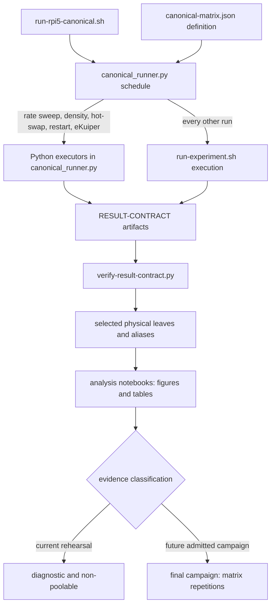

# From experiment definition to evidence

> **Documentation type:** Tutorial
>
> **Prerequisites:** [Learning guide orientation](README.md), basic JSON and Python reading, and the evaluation terminology in `eval/RESULT-CONTRACT.md`.

## Purpose

Trace an evaluation claim from its machine-readable experiment definition through execution, result validation, selected physical evidence, derived datasets, and final evidence classification. The goal is to keep execution count, observation count, and evidence status separate.

## Prerequisites

Read this against a current checkout of `main`. Do not open or quote raw result values to complete the walkthrough. Paths, schemas, validators, and tests are enough to understand the evidence boundary.

## Flow

1. `eval/canonical-matrix.json` defines experiment IDs, condition grids, repetitions, sample units, required outputs, ordering, metering, evidence class, and admission flags. Each experiment in the `enhanced_candidate` block is N=5 candidate or diagnostic work and sets `thesis_evidence=false` and `n30_admitted=false`.
2. `eval/scripts/run-rpi5-canonical.sh` runs `eval/scripts/lib/canonical_runner.py` (`main`), which turns definitions into deterministic `RunItem` schedules (`build_schedule`). `run_attempt` picks the execution path. Rate sweeps (`e-perf-10` and the capacity runs), `e-density-1`, the hot-swap runs (`e-swap-1`, `e-swap-4`, `e-swap-5` and the session experiments), `e-swap-3` restarts, and eKuiper runs go to Python executors in the same file, which start their own processes. Every other run calls `run-experiment.sh`. The runner writes progress and summaries, post-processes outputs, and calls `verify_result` for each physical leaf.
3. `eval/scripts/run-experiment.sh` handles one run: configuration, runtime and load-generator processes, bounded collection, shutdown, metadata, and result placement. It writes to the exact `--output-dir` the runner passes, or delegates fresh local result-directory creation to `eval/scripts/collect-results.sh`, which creates `eval/results/<experiment>/<host>-<UTC timestamp>/` and never overwrites an existing directory.
4. `eval/RESULT-CONTRACT.md` assigns each artifact to its producer and states which experiments require it. `eval/scripts/verify-result-contract.py` and experiment-specific checks reject missing, malformed, inconsistent, or wrongly classified evidence.
5. Shared experiment IDs are aliases to one selected physical leaf. An alias receipt preserves identity; it does not copy evidence or create another replicate.
6. The notebooks under `eval/analysis/notebooks/` resolve their input through `wafer_analysis.paths.resolve_analysis_batch`: an explicit diagnostic path, or the approved batch named by `WAFER_EVAL_BATCH_ID`. The cross-architecture notebook, `04-cross-arch.ipynb`, uses `resolve_host_batches` instead and resolves one batch per host. The notebooks render figures and tables that carry run counts, units, estimator, and evidence class.

## Rust

When a run starts the runtime, the harness sets `WAFER_BENCH_OUTPUT_DIR` to the result directory, and the runtime writes its artifacts there. The "Ownership summary" in `eval/RESULT-CONTRACT.md` maps every file to its producer. The Rust producers are:

- `BenchSink::export_to_dir` (`crates/wafer-core/src/node/sink/bench.rs`) writes the in-process `latency.hdr` and `throughput.csv` when the sink closes, plus `service.hdr` and `source-lag.hdr` when messages carried bench stamps, and `sequence.csv` and `swap_timeline.json` when enabled. `BenchSource` (`crates/wafer-core/src/node/source/bench.rs`) generates load inside the runtime.
- `flush_bench_artifacts` in `crates/wafer-runtime/src/main.rs` writes `memory.csv`, and `queue-depth.csv` to the path in `WAFER_QUEUE_DEPTH_OUTPUT` when that is set, from the samplers in `crates/wafer-core/src/bench/`, then `per_node_metrics.csv` and `recovery.csv` through `PipelineOrchestrator::export_per_node_metrics` (`crates/wafer-core/src/orchestrator/pipeline.rs`).
- `crates/wafer-runtime/src/metadata.rs` (`write_provenance`) writes `runtime-provenance.json`, which the harness merges into `metadata.json`. `crates/wafer-runtime/src/startup.rs` (`write_startup`) writes the startup-phase file named by `WAFER_STARTUP_OUTPUT` (`startup.json`).
- `LatencyRecorder::write_artifacts` (`crates/wafer-loadgen/src/recorder.rs`) writes the end-to-end `latency.hdr`, `sequence.csv`, and `subscriber-metadata.json` for `wafer-loadgen subscribe`.

The controller and analysis are Python. `RunItem` is a frozen dataclass carrying one physical run identity. `ResultsLayout` (`eval/analysis/src/wafer_analysis/results_layout.py`) confines raw, manifest, derived, and report paths: under `eval/` by default, or under a mounted `WAFER_RESULTS_ROOT`. Analysis reads selected raw files and writes outside the raw tree.

Counts need type-like discipline even though Python tables are dynamic. A complete host run is an independent sample. Messages, aliases, events, buckets, and one-second intervals are nested observations or alternate views. More rows improve within-run detail; they do not increase independent N.

## Design

Evidence classification is part of the data contract, not a caption added later. The completed expanded N=5 rehearsal is diagnostic, descriptive, and non-poolable with final or earlier campaigns. Its records remain `thesis_evidence=false` and outside N=30 admission.

Final N=30 remains PENDING because the frozen final campaign has not been admitted as completed evidence. E-Perf-5 remains PENDING until its matching x86 Linux block exists. PMIC readings remain an internal-rail proxy, not total input power.

Capacity classification is support-aware. When the MQTT loopback support cell is delivery-bad, affected SUT cells at that rate and above are support-confounded. These cells set neither bound of a delivery ceiling, even if a SUT leaf contains measurements. A nested interval, bucket, message, or event cannot remove that censoring.

Do not quote old desktop or Raspberry Pi 4 shakedown values as current or final evidence. Historical layouts remain readable for provenance, not promotion.

## Status boundaries

**Current implementation:** The matrix, runners, result verifier, storage layout, analysis notebooks, and tests encode distinct raw, alias, derived, and evidence-class boundaries. Diagnostic batches, including the N=5 rehearsal and later per-host diagnostic batches, support descriptive patterns only.

**Intended design:** A future fully admitted final campaign uses the repetitions set per experiment in `eval/canonical-matrix.json` (30 for most experiments) on the canonical Raspberry Pi 5 and the Jetson and x86 replication hosts, and preserves the same artifact and provenance discipline.

**Known drift:** Some matrix entries describe the frozen final design with `thesis_evidence=true`; that declaration does not prove execution or admission. Read it together with campaign status, terminal receipts, and the external-gap rules. In particular, E-Perf-5's final definition remains incomplete until matched x86 execution exists.

## Checkpoint

Choose one figure from an analysis notebook and trace it back to its batch, the physical result leaves it reads, their independent run indexes, nested observations, and evidence class. Then explain why fifty swap events in each of five runs still means N=5 rather than N=250.
