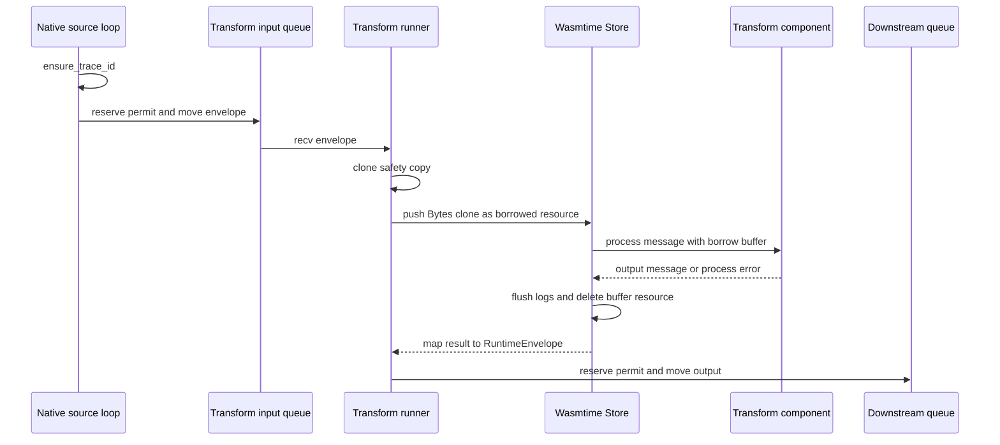

# Follow one message through Wasm

> **Documentation type:** Tutorial
>
> **Prerequisites:** [Configuration to running pipeline](config-to-running-pipeline.md) and familiarity with [ownership](rust-in-context.md#ownership), [move](rust-in-context.md#move), [Arc](rust-in-context.md#arc), [borrow](rust-in-context.md#borrow), and [RAII](rust-in-context.md#raii).

## Purpose

This walkthrough follows one `RuntimeEnvelope` from a native source, through a transform component, to the next bounded queue. It focuses on ownership and the real allocation boundaries so that "zero-copy" is not applied more broadly than the source supports.

## Flow

### 1. Create and identify the envelope

A native source adapter returns a `RuntimeEnvelope`. Its immutable `EnvelopeHeader` is held by `Arc`, its payload by `Bytes`, and its lineage is owned directly. `run_source_loop` calls `envelope.ensure_trace_id()` before forwarding the message.

`send_downstream` moves the envelope when there is one destination. With multiple destinations, it clones for all but the last sender. Those clones increment `Arc` and `Bytes` reference counts instead of copying the header and payload bytes. The envelope clone tests verify both shared backing stores.

### 2. Wait for queue capacity

Every downstream send reaches `send_one`. It waits on `sender.reserve().await`, records queue metrics after obtaining a permit, and then moves the envelope into the channel.

The prose anchor `sender.reserve().await` describes the call in `send_one`; the exact source expression is `sender.sender.reserve().await` because `DownstreamSender` wraps Tokio's sender.

**Known drift:** The builder retains configured overflow metadata in `EdgeSender`, but drops it when creating `DownstreamSender`. This path therefore waits for capacity and does not currently dispatch configured `Drop` or `DeadLetter` behavior.

### 3. Receive outside the guest

`run_transform_loop_with_config` first checks swap and retry state. When neither supplies a message, a biased `tokio::select!` waits for cancellation or `receiver.recv()`. After a message arrives, the runner clones it into `safety` for retry or DLQ handling.

The runner executes `tokio::task::block_in_place(|| transform.process(envelope))` after the cancellation `select!`, not as one of its branches. Cancellation can stop the next receive, but it does not drop an active Wasmtime call and poison its `Store`.

### 4. Build the WIT input

`WasmTransformNode::process` performs the per-call setup in this order:

1. clear the host log buffer;
2. reset configured fuel;
3. reset the relative epoch deadline;
4. call `build_wit_message`;
5. invoke the typed guest `process` export;
6. flush guest logs;
7. delete the host-owned buffer resource, including after a trap;
8. map the result.

`build_wit_message` clones the `Bytes` handle into the store's resource table, copies header strings and metadata into the generated WIT record, and passes a borrowed resource handle. The WIT `message` declares `payload: borrow<buffer>`, so the guest can avoid reading payload bytes when its logic does not need them.

### 5. Map the guest result

The transform interface returns either an `output-message` or one of five `process-error` variants. A successful output carries `payload: list<u8>`. The host turns that vector into new `Bytes`, copies output metadata, and inherits lineage from the input.

Input payload access uses `borrow<buffer>`, but transform output is a WIT `list<u8>` that becomes new host `Bytes`; the whole boundary is not zero-copy. The current mapping uses the guest's `source`, payload, and metadata. It creates a fresh host envelope, so the guest-provided output ID, timestamp, and content type are not copied into the resulting header.

The borrowed input resource remains host-owned. `process` captures its resource representation before the guest call and calls `delete_buffer` afterward even if Wasmtime returned a trap. Cleanup failure becomes `WasmProcessError::Unrecoverable`.

### 6. Return to bounded queues

On success, the runner records processing duration and passes the output to `send_downstream`. On a WIT error or trap, the safety clone is available for retry, DLQ, timeout recovery, or rollback logic. The next page explains those branches and shutdown behavior.

## Rust

### Move the ordinary case, clone only for alternatives

The source loop and channel send consume an owned `RuntimeEnvelope`. The transform call also consumes the input. Clones exist only when fan-out needs multiple messages or failure handling needs a safety copy.

### `Arc` and `Bytes` make host clones cheap

`Arc<EnvelopeHeader>` and `Bytes` share allocations across host-side clones. This does not mean every boundary is allocation-free: WIT strings and metadata are materialized, and a transform's `list<u8>` output becomes new host-owned bytes.

### Borrowed resources still require cleanup

The WIT borrow prevents transfer of buffer ownership to the guest. The host registers the resource before the call and removes it after the call. The cleanup is explicit rather than automatic Rust lifetime checking because the handle lives in Wasmtime's resource table.

### `block_in_place` protects the Tokio worker pool

The generated binding call is synchronous and can use Wasmtime's synchronous WASI bridge. `block_in_place` tells the multi-thread Tokio runtime that the worker may block so other tasks can move. It does not make the guest call cancellable.

## Design

The hot path uses three distinct seams:

- native adapters create and consume host envelopes;
- bounded channels transfer ownership between node tasks;
- typed Component Model bindings translate between host envelopes and guest records.

That division keeps `Store` ownership local to one processing task. It also makes cancellation correctness more important than immediate cancellation latency: a running guest call completes before its store is reused or replaced.

### What the tests establish

The envelope unit tests establish shared host-side clone storage. The source-loop test establishes trace assignment and movement through a bounded channel. The component harness tests cover output metadata and repeated epoch-deadline resets only when the required prebuilt component exists; their explicit skip path means a missing artifact is not execution proof.

## Status boundaries

**Current implementation:** Source ingress assigns a trace ID, bounded sends await permits, the transform runner invokes Wasm outside its cancellation `select!`, and the transform wrapper resets limits, cleans up the borrowed resource, preserves output metadata, and inherits lineage.

**Intended design:** Borrowed input resources allow guests such as filters and routers to avoid payload reads. That is a targeted optimization, not a claim that all host and guest marshalling is zero-copy.

**Known drift:** Configured edge overflow metadata does not reach `DownstreamSender`. Transform output mapping also regenerates ID, timestamp, and content type instead of using those three guest output fields.

## Evidence

- **Source:** [`crates/wafer-core/src/queue/envelope.rs`](../../crates/wafer-core/src/queue/envelope.rs) | symbols: `pub struct RuntimeEnvelope`, `Arc<EnvelopeHeader>`, `pub payload: Bytes`
- **Source:** [`crates/wafer-core/src/runner/source.rs`](../../crates/wafer-core/src/runner/source.rs) | symbols: `pub async fn run_source_loop`, `envelope.ensure_trace_id()`
- **Source:** [`crates/wafer-core/src/runner/transform.rs`](../../crates/wafer-core/src/runner/transform.rs) | symbols: `pub async fn run_transform_loop_with_config`, `tokio::task::block_in_place(|| transform.process(envelope))`
- **Source:** [`crates/wafer-core/src/runner/mod.rs`](../../crates/wafer-core/src/runner/mod.rs) | symbols: `pub async fn send_downstream`, `async fn send_one`, `sender.sender.reserve().await`
- **Source:** [`crates/wafer-core/src/node/wasm.rs`](../../crates/wafer-core/src/node/wasm.rs) | symbols: `fn build_wit_message`, `pub fn process`, `delete_buffer`
- **Source:** [`wit/pipeline-types.wit`](../../wit/pipeline-types.wit) | symbols: `record message`, `payload: borrow<buffer>`, `record output-message`
- **Source:** [`wit/pipeline-node.wit`](../../wit/pipeline-node.wit) | symbols: `interface transform`, `process: func(input: message)`
- **Test:** [`crates/wafer-core/src/queue/envelope.rs`](../../crates/wafer-core/src/queue/envelope.rs) | symbols: `fn test_clone_shares_header_via_arc()`, `fn test_clone_shares_payload_bytes()`
- **Test:** [`crates/wafer-core/src/runner/source.rs`](../../crates/wafer-core/src/runner/source.rs) | symbol: `async fn test_source_loop_messages_flow()`
- **Test:** [`crates/wafer-core/src/testing/harness.rs`](../../crates/wafer-core/src/testing/harness.rs) | symbols: `fn pass_through_propagates_metadata()`, `fn pass_through_survives_epoch_deadline_wraparound()`

## Checkpoint

Trace one message in your own words. Identify each ownership move, each intentional clone, the exact point at which payload bytes may be copied, and why cancellation waits around receive but not around the guest call.
