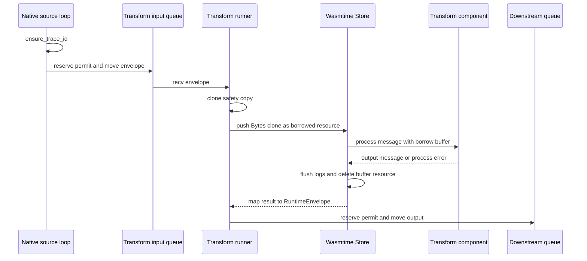

# Follow one message through Wasm

> **Documentation type:** Tutorial
>
> **Prerequisites:** [Configuration to running pipeline](config-to-running-pipeline.md) and familiarity with [ownership](rust-in-context.md#ownership), [move](rust-in-context.md#move), [Arc](rust-in-context.md#arc), [borrow](rust-in-context.md#borrow), and [RAII](rust-in-context.md#raii).

## Purpose

This walkthrough follows one `RuntimeEnvelope` from a native source, through a transform component, to the next bounded queue. It focuses on ownership and the real allocation boundaries so that "zero-copy" is not applied more broadly than the source supports.

## Flow

### 1. Create and identify the envelope

A native source adapter returns a `RuntimeEnvelope` (`crates/wafer-core/src/queue/envelope.rs`). Its immutable `EnvelopeHeader` is held by `Arc`, its payload by `Bytes`, and its lineage and retry count are host-owned. New ingress timestamps are checked, saturating Unix-epoch nanoseconds. `run_source_loop` (`crates/wafer-core/src/runner/source.rs`) calls `envelope.ensure_trace_id()` before forwarding the message.

`send_downstream` (`crates/wafer-core/src/runner/mod.rs`) moves the envelope when there is one destination. With multiple destinations, `send_matching` serves `drop` and `dead-letter` edges before `slow` ones and clones for all but the last sender. Those clones increment `Arc` and `Bytes` reference counts instead of copying the header and payload bytes; only the two small lineage strings are copied. The envelope clone tests verify both shared backing stores.

### 2. Apply the configured edge policy

Every downstream send reaches `send_one` in the same file, which reads the edge's overflow policy from `DownstreamSender` and records a closed destination, a full DLQ, and a closed DLQ as distinct outcomes. [Tokio in context](tokio-in-context.md#bounded-mpsc-between-nodes) explains the `reserve().await` and `try_send` calls it chooses between and the destination-keyed queue that fan-in edges share.

### 3. Receive outside the guest

At the top of each iteration, `run_transform_loop_with_config` (`crates/wafer-core/src/runner/transform.rs`) applies a pending swap or replays a rolled-back message. Otherwise it calls `next_input` (`crates/wafer-core/src/runner/mod.rs`), which returns a held envelope first and then delegates to `recv_next_or_retry`. That function returns a ready retry if there is one. When there is none, a biased `tokio::select!` waits for cancellation, `receiver.recv()`, a published swap (`swap_rx.changed()`), or the next retry deadline. `receiver` is a `TrackedReceiver`, which wraps the `mpsc` receiver to count dequeues and remember EOF. A swap therefore wakes an idle node; a message that arrives while a swap is pending is held and processed by the replacement. After a message arrives, the runner clones it into `safety` for retry or DLQ handling. [Tokio in context](tokio-in-context.md) explains `biased` and the pinned cancellation future.

The runner awaits `transform.process(envelope).await` after the cancellation `select!`, not as one of its branches. Here `transform` is the runner's `TransformNode` enum (`crates/wafer-core/src/node/mod.rs`), not the bindgen-generated type of the same name; its `Wasm` variant forwards to `WasmTransformNode::process` (`crates/wafer-core/src/node/wasm.rs`). Wasmtime's asynchronous P2 binding may yield while servicing host calls, but cancellation can stop only the next receive; it does not drop an active Wasm future and leave its `Store` inconsistent.

### 4. Build the WIT input

The launcher built this node, with its own `Store`, in `load_transform_node` (`crates/wafer-core/src/orchestrator/launcher.rs`). `WasmTransformNode::process` performs the per-call setup in this order:

1. clear the host log buffer;
2. reset configured fuel;
3. reset the relative epoch deadline;
4. call `build_wit_message`;
5. invoke the typed guest `process` export;
6. flush guest logs;
7. delete the host-owned buffer resource, including after a trap;
8. map the result.

`build_wit_message` clones the `Bytes` handle into the store's resource table (`push_buffer` in `crates/wafer-core/src/engine/state.rs`), copies header strings and metadata into the generated WIT record, and passes a borrowed resource handle. The WIT `message` in `wit/pipeline-types.wit` declares `payload: borrow<buffer>`, so the guest can avoid reading payload bytes when its logic does not need them.

The input payload is copied only when the guest reads it. A guest call to `read` or `read-all` on the buffer lands in the `HostBuffer` impl on `WaferState` (`crates/wafer-core/src/engine/bindings.rs`), which calls `WaferBuffer::read` or `read_all` (`crates/wafer-core/src/engine/buffer.rs`). Those copy the bytes into a new host `Vec<u8>` with `to_vec`, and Wasmtime then copies that `list<u8>` into guest linear memory. [Wasmtime in context](wasmtime-in-context.md) explains resource handles and the generated bindings.

### 5. Map the guest result

The transform interface returns either an `output-message` or one of five `process-error` variants. A successful output carries `payload: list<u8>`. `RuntimeEnvelope::from_guest_output` (`crates/wafer-core/src/queue/envelope.rs`) builds the new envelope from the guest-provided id, timestamp, source, content type, metadata, and payload. Lineage and benchmark stamps come from the input. `retry_count` starts at zero, because retries are budgeted per node.

Input payload access uses `borrow<buffer>`, but Transform output is a WIT `list<u8>`: Wasmtime copies it out of guest memory into a host `Vec<u8>`, which becomes the new envelope's `Bytes`. The whole boundary is not zero-copy. Guest-provided timestamps remain message data and never replace host-owned benchmark clocks.

The borrowed input resource remains host-owned. `process` captures its resource representation before the guest call and calls `delete_buffer` (`crates/wafer-core/src/engine/state.rs`) afterward even if Wasmtime returned a trap. Cleanup failure after a completed call becomes `WasmProcessError::Trapped` without a trap code; after a trap, the trap's own code is kept.

### 6. Return to bounded queues

On success, the runner increments the node's processed counter (`NodeMetrics::record_processed` in `crates/wafer-core/src/node/metrics.rs`) and passes the output to `send_downstream`. If a hot-swap is waiting for its first outcome, or a canary window is open, the runner then records that as well. On a WIT error or trap, the safety clone is available for retry, DLQ, timeout recovery, or rollback logic. [Shutdown and failure behavior](shutdown-and-failure.md) explains those branches.

## Rust

### Move the ordinary case, clone only for alternatives

The source loop and channel send consume an owned `RuntimeEnvelope`. The transform call also consumes the input. Clones exist only when fan-out needs multiple messages or failure handling needs a safety copy.

### `Arc` and `Bytes` make host clones cheap

`Arc<EnvelopeHeader>` and `Bytes` share allocations across host-side clones. This does not mean every boundary is allocation-free: WIT strings and metadata are materialized, and a transform's `list<u8>` output becomes new host-owned bytes.

### Borrowed resources still require cleanup

The buffer lives in the Store's resource table, and dropping a `Resource` handle in Rust does not remove the entry; [Wasmtime in context](wasmtime-in-context.md#resource-handles) shows how `build_wit_message` and `process` use `rep()`, `Resource::new_borrow`, and `Resource::new_own` to delete the entry after every call.

### Async host bindings do not make the guest concurrently callable

The project's WIT exports remain synchronous from the guest's perspective. The host awaits the async export call generated in `crates/wafer-core/src/engine/bindings.rs`, and `build_linker` (`crates/wafer-core/src/engine/loader.rs`) adds the WASI and `wasi:http` host functions in their async form, so a guest host call such as an outbound HTTP request can yield to Tokio without a nested runtime or blocking bridge. The node still owns one Store and permits one guest call at a time.

## Design

The hot path uses three distinct seams:

- native adapters create and consume host envelopes;
- bounded channels transfer ownership between node tasks;
- typed Component Model bindings translate between host envelopes and guest records.

That division keeps `Store` ownership local to one processing task. It also makes cancellation correctness more important than immediate cancellation latency: a running guest call completes before its store is reused or replaced.

### What the tests establish

The envelope unit tests establish shared host-side clone storage. The source-loop test establishes trace assignment and movement through a bounded channel. The component harness tests cover output metadata and repeated epoch-deadline resets only when the required prebuilt component exists; their explicit skip path means a missing artifact is not execution proof.

## Status boundaries

**Current implementation:** Source ingress assigns a trace ID, configured edge overflow reaches the shared send seam, the transform runner awaits Wasm outside its cancellation `select!`, and the transform wrapper resets limits, cleans up the borrowed resource, preserves every guest output field, inherits lineage and benchmark stamps, and resets the retry count.

**Intended design:** Borrowed input resources allow guests such as filters and routers to avoid payload reads. That is a targeted optimization, not a claim that all host and guest marshalling is zero-copy.

**Known drift:** None for the path described above. Host-side `Arc`/`Bytes` clones do not make Transform output or WIT strings zero-copy; fan-in also has no fairness or ordering guarantee.

## Checkpoint

Trace one message in your own words. Identify each ownership move, each intentional clone, the exact point at which payload bytes may be copied, and why cancellation waits around receive but not around the guest call.
