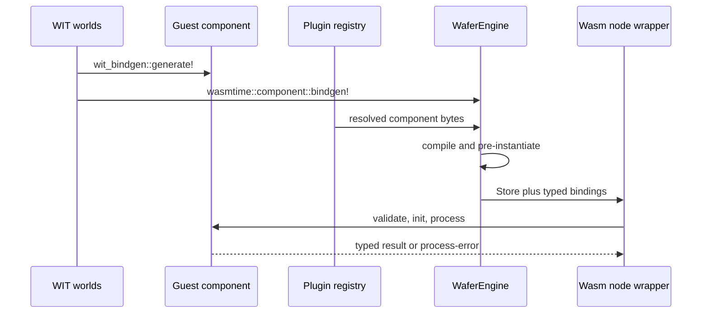

# Cross the plugin boundary

> **Documentation type:** Tutorial
>
> **Prerequisites:** [Learning guide orientation](README.md), [Follow one message through Wasm](message-through-wasm.md), and familiarity with Rust traits and `Result`.

## Purpose

Trace one processing plugin from its WIT world through generated guest and host bindings into a live Wasmtime instance. The goal is to identify which side owns each value and where the runtime enforces the boundary without copying the WIT reference tables.

## Prerequisites

Keep the [WIT contracts](../interfaces/wit-contracts.md) open for signatures and the [plugin SDK reference](../interfaces/plugin-sdk.md) open for macro details. This walkthrough follows the source on `main`, which includes the asynchronous P2 host path and bounded outbound HTTP implementation.

## Flow

1. `wit/worlds.wit` exposes four guest worlds: `transform-node`, `filter-node`, `router-node`, and `inference-node`. Their shared lifecycle and message types come from the other project WIT files. Transform, Filter, and Router remain the processing roles; `inference-node` is a Transform specialization with pinned wasi-nn imports, not another topology role. Sources and sinks remain native adapters created by `create_source` and `create_sink`.
2. A guest chooses one world with `wit_bindgen::generate!`, implements the generated lifecycle and processing traits, and calls `export!`. `plugins/pass-through/src/lib.rs` is the smallest complete transform example. The threshold filter reads its payload through `wafer_plugin::payload_as_str!`, the content router calls `read_all()` directly, and `plugins/mnist-inference/src/lib.rs` invokes wasi-nn through generated `inference-node` bindings.
3. The host runs `wasmtime::component::bindgen!` for each world in `engine/bindings.rs`. Ordinary and inference Transform bindings reuse the canonical types, lifecycle, transform, and logging definitions while retaining distinct private pre-instantiation types.
4. `launch_pipeline_timed` builds native sources and sinks separately. For a Wasm processing node, `resolve_and_load_component` asks `WaferRegistry::resolve` for a local or OCI artifact, reads and hashes its bytes, then calls `WaferEngine::load_component_from_bytes`.
5. `WaferEngine` owns the Wasmtime `Engine`. Its private `build_linker` adds asynchronous P2 WASI and HTTP interfaces. Ordinary `pre_instantiate_*` paths add their generated world; `pre_instantiate_inference` additionally registers wasi-nn before creating the typed pre-instance. Linking `wasi:http` does not grant a destination.
6. The launcher creates a fresh `Store<WaferState>`, installs memory and optional fuel or epoch limits, awaits typed instantiation, and calls `validate_and_init`. Only a Wasm Transform with `allow_inference = true` receives an ONNX-backed inference state. Wasm processing nodes receive outbound HTTP authority only for configured exact destinations. The node wrapper then owns the Store, bindings, and cached pre-instance.
7. For each call, `build_wit_message` installs a host buffer resource and passes a borrowed handle. The runner awaits the generated host call outside cancellation `select!`. After it returns, the wrapper flushes guest logs, calls `delete_buffer`, and maps the typed result or trap into the host error model.

## Rust

The two binding generators face opposite directions. `wit_bindgen::generate!` creates traits and exports implemented by guest Rust. `wasmtime::component::bindgen!` creates typed host calls and linker helpers. A `Store<WaferState>` owns one instance's host context, resource table, limits, and buffered logs. `Arc<...Pre<WaferState>>` shares compiled, pre-linked machinery without sharing a live Store.

The WIT input is `borrow<buffer>`, so the host retains payload ownership while the guest may request bytes. A transform returns an owned `list<u8>`; filter and router return decisions. These are different copy boundaries, not a claim that every plugin avoids payload reads.

## Design

The WIT surface contains processing semantics, not transport protocols. Native source and sink traits own external I/O. The current launcher also has native baseline dispatch for Transform and Filter, while Router loading is Wasm-only. That baseline support does not create source-node or sink-node WIT worlds.

The Engine is shared, but each node gets a Store and instance. This keeps mutable guest memory local to one node task. The host awaits one guest call at a time. Capabilities, memory limits, fuel, epoch interruption, resource cleanup, outbound HTTP policy, and guest log forwarding remain host responsibilities. The memory limit covers guest linear memory and tables; host-side WASI resources a guest creates are not bounded by it. Fuel and epochs bound Wasm execution time, not time spent blocked inside a host import.

Do not duplicate signatures here. When the WIT and this walkthrough disagree, the WIT and generated-call sites are authoritative.

## Status boundaries

**Current implementation:** The four WIT worlds, both binding-generation directions, registry resolution, async P2 Engine/Linker/Store lifecycle, guest lifecycle calls, buffer cleanup, and native source/sink factories are present in the cited source. Inference is default deny and restricted to Wasm Transform nodes. Outbound HTTP is default deny and restricted to exact destinations for Wasm processing nodes. Non-skipping tests exercise both capability families, lifecycle store replacement, and the known-digit CPU path.

**Intended design:** Borrowed buffers make payload transfer demand-driven and keep protocol adapters outside the guest contract. A plugin can still call `read-all`, as all three cited first-party examples currently do.

**Known drift:** Source comments that describe filter or router plugins as never reading payloads are broader than the current threshold-filter and content-router implementations. Treat the plugin code as authoritative. A fixture-gated integration test that prints `SKIP` is not execution evidence.

## Checkpoint

Starting at `plugins/pass-through/src/lib.rs`, identify the guest-generated trait, the matching host-generated binding, the loader method that builds its Store, and the call site that deletes the borrowed buffer resource. Then explain why adding a source or sink requires a native adapter rather than a new processing world.
