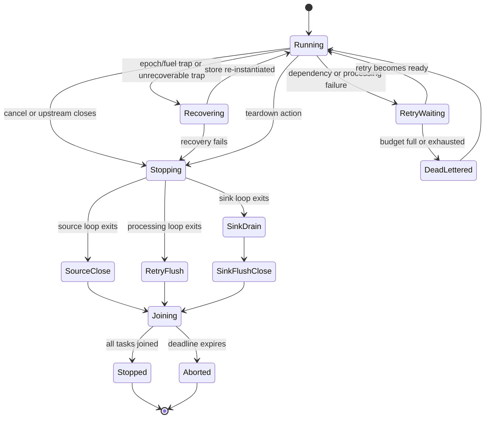

# Shutdown and failure behavior

> **Documentation type:** Explanation
>
> **Prerequisites:** [Configuration to running pipeline](config-to-running-pipeline.md), [Follow one message through Wasm](message-through-wasm.md), and familiarity with [Result](rust-in-context.md#result), [RAII](rust-in-context.md#raii), and an [async function](rust-in-context.md#async-function).

## Purpose

This page explains what current runners do when input ends, cancellation arrives, a guest returns an error, a Wasm call traps, or tasks exceed the shutdown deadline. These paths share a cancellation token, but they do not form a single reverse-ordered shutdown algorithm.

## Flow

The diagram combines several node-local paths. It does not imply that every task visits every state or that cleanup occurs in the displayed vertical order. Its `Running` is a conceptual phase, not the reported `NodeState`: a Wasm Transform, Filter, or Router node's tracker starts in `Starting` and is not moved to `Running` after a successful startup, so a node that never failed reports `Starting` for the whole run. The tracker reaches `Running` only after a recovery (or in the native passthrough loop).

### Natural completion

A finite source exits when `poll()` returns `Ok(None)`. `run_source_loop` then calls `source.close().await`. Returning from the source task drops its downstream senders. A transform or sink whose last sender disappears receives `None` and leaves its loop. This channel-close cascade lets `run_until_complete` finish when its `JoinSet` becomes empty.

### External cancellation

The runtime signal task and the control-plane shutdown handler both cancel the orchestrator's shared `CancellationToken`. Every node bundle owns a child token. Source, transform, and sink loops use biased `tokio::select!` branches while awaiting their native poll or queue receive operation.

A transform already executing guest code does not observe cancellation during that call. The guest call runs outside `select!` and completes before the runner reaches its next cancellation check. This protects the Wasmtime `Store` from being abandoned midway through an asynchronous cancellation race.

The orchestrator joins whichever task completes next until the deadline; it does not shut nodes down in reverse topological order. Both `shutdown` and the cancellation branch of `run_until_complete` use this bounded join pattern. If the deadline expires, they call `self.tasks.shutdown().await`, which aborts the tasks still held by the `JoinSet`.

### Node-local cleanup

Cleanup differs by runner:

- The source loop calls `source.close().await` after cancellation, EOF, or its exit path.
- Transform, filter, and router loops call `policy.flush_to_dlq("shutdown", &metrics)` when their loop exits, moving buffered retries to the DLQ path when a sender is available.
- The sink loop exits its receive phase, uses `receiver.try_recv()` to consume messages already buffered, then calls `sink.flush().await` and `sink.close().await` even if collection during the drain reported an error.
- The DLQ task receives the same cancellation token and drains entries already buffered in its own channel before exiting.

A sink drains envelopes already buffered in its receiver, but the bounded orchestrator deadline means shutdown does not guarantee that every in-flight message completes. A message still executing in another node, waiting for queue capacity, or held in an aborted task can remain unfinished when the deadline expires.

### Guest errors and traps

WIT defines five process-error categories. `ErrorPolicyExecutor::handle` treats them as follows:

| Category | Current executor behavior |
|---|---|
| `bad-input` | Apply the configured simple action: skip, DLQ, or teardown (stop the node's loop). |
| `dependency-failed` | Add to the bounded retry buffer with capped exponential backoff, or apply its configured exhausted action. |
| `processing-failed` | Use the same bounded retry and terminal-action path. |
| `timed-out` | Apply the configured `timed_out` simple action. |
| `unrecoverable` | Return control to the runner's recovery path rather than queue a normal retry. |

The runners give ready retries priority over fresh messages and wake at the earliest due deadline even when upstream is idle. Retry count survives requeue. Once exhausted, `skip`, `dlq`, or `teardown` is honored; DLQ-full and DLQ-closed remain distinct outcomes and the envelope is not requeued. Transform preserves a safety clone before calling Wasm. Pending retries are flushed to the DLQ on shutdown or before replacement.

Wasmtime traps and host failures during the call become `Trapped`, which keeps the wasmtime trap code when there is one. An epoch interruption or fuel exhaustion is a timeout: the `timed_out` action applies, then the store is recreated when policy permits. Inside a transform's hot-swap canary window it counts as a trap instead. Any other trap, and a plugin-returned `unrecoverable`, can first use the bounded hot-swap canary rollback path when one is active, then falls back to re-instantiation from the cached pre-instantiated component. If recovery fails, that node loop exits. A plugin-returned `timed-out` only applies the `timed_out` action; its instance is kept.

### Task and process results

`run_until_complete` records each node task that panicked, returned an error (for example a source or sink `init()` failure), or had to be aborted at the deadline, plus a failed or stuck DLQ task. After joining node tasks and waiting up to five seconds for the DLQ task, it returns one error naming every failure. The runtime logs that error, finishes its benchmark/control-plane cleanup so artifacts are written, and then exits with status 3.

The `shutdown` method cancels the token and then calls `run_until_complete`, so both entry points report failures the same way.

## Rust

### `CancellationToken` broadcasts intent

The parent token creates child tokens for node bundles. Cancelling the parent wakes the child futures, but it does not forcibly unwind synchronous work. Force enters only when the orchestrator's timeout calls `JoinSet::shutdown`.

### `tokio::select!` protects cancellable waits

Queue receive and native source polling are cancellation points. The `biased` order checks cancellation before another ready branch. Guest calls remain outside the macro because dropping a future that owns mutable Wasmtime state midway through a call is not accepted as safe here.

### `JoinSet` owns task lifetimes

`JoinSet::join_next` yields whichever task completes next. It is not a topological iterator. `JoinSet::shutdown` aborts remaining tasks and waits for cancellation completion after the cooperative deadline has been exhausted.

### `Result` does not imply propagation unless the caller uses it

`ErrorPolicyExecutor::handle` returns a typed `ErrorPolicyAction`. The shared runner handler `continue_after_policy_action` turns each outcome into one counter increment (`retries`, `dlq_sent`, `skipped`, `retry_exhausted_skips`, `dlq_lost`, or `dropped_on_teardown`) and returns false only for `Teardown`. Every caller then `break`s out of its processing loop, which ends that node's task for the rest of the process. The configurable `teardown` action is therefore a one-way stop, not recovery: only the built-in trap and `unrecoverable` path calls `transition_to_error`, `transition_to_recovering`, and `recover_from_cached_pre`.

## Design

Shutdown has two layers:

1. cooperative node behavior, where cancellation or channel closure leads to source close, retry flush, sink drain, sink flush, and sink close;
2. bounded orchestration, where the `JoinSet` gets a fixed window before remaining tasks are aborted.

This makes shutdown finite even if an adapter or task fails to cooperate. The trade-off is that "graceful" describes attempted cleanup, not guaranteed completion of all messages.

The window is 5 s. `JoinSet::shutdown` cannot stop a guest that is still running with no fuel or epoch limit, so the runtime binary also exits at once, with status 143 or 130, on a second SIGTERM or SIGINT. Its signal listener runs on a dedicated thread with its own Tokio runtime, because a spinning guest can starve the main runtime's drivers.

Failure handling is similarly layered. WIT errors are typed data processed by `ErrorPolicyExecutor`; Wasmtime traps can require store recovery; task panics are observed at the orchestrator boundary. Keeping those categories separate avoids treating every guest failure as either a process crash or a retryable record.

## Status boundaries

**Current implementation:** Cancellation is broadcast to node tasks; cancellable waits leave their loops; active Wasm calls complete before observing cancellation; sinks drain their current receiver buffers and then flush and close; the orchestrator aborts remaining `JoinSet` tasks after its deadline.

**Intended design:** The combination of bounded retries, DLQ routing, store recovery, and cooperative cleanup aims to keep one bad message or guest instance from leaving the process indefinitely stuck.

**Known drift:** Shutdown is cancel-all, not reverse-topological, and does not prove completion of every in-flight message; only sinks drain their own buffered queue. The guest `close()` export is never called. A failed DLQ enqueue (full or closed sink) is counted as `dlq_lost` but cannot recover the message; the validator rejects a `dlq` action with no `[dead_letter]` sink. The `teardown` action stops the node permanently and does not update its reported state. Healthy Wasm nodes report `Starting` rather than `Running`.

## Evidence

- **Source:** [`crates/wafer-core/src/orchestrator/pipeline.rs`](../../crates/wafer-core/src/orchestrator/pipeline.rs) | symbols: `pub async fn shutdown`, `pub async fn run_until_complete`, `self.tasks.shutdown().await`
- **Source:** [`crates/wafer-core/src/runner/source.rs`](../../crates/wafer-core/src/runner/source.rs) | symbols: `pub async fn run_source_loop`, `source.close().await`
- **Source:** [`crates/wafer-core/src/runner/transform.rs`](../../crates/wafer-core/src/runner/transform.rs) | symbols: `pub async fn run_transform_loop_with_config`, `let result = transform.process(envelope).await`, `policy.flush_to_dlq("shutdown", &metrics)`
- **Source:** [`crates/wafer-core/src/runner/sink.rs`](../../crates/wafer-core/src/runner/sink.rs) | symbols: `pub async fn run_sink_loop`, `receiver.try_recv()`, `sink.flush().await`, `sink.close().await`
- **Source:** [`crates/wafer-core/src/runner/error_policy.rs`](../../crates/wafer-core/src/runner/error_policy.rs) | symbols: `pub(crate) fn handle`, `pub fn flush_to_dlq`, `DlqReason::Shutdown`
- **Test:** [`crates/wafer-core/src/orchestrator/pipeline.rs`](../../crates/wafer-core/src/orchestrator/pipeline.rs) | symbols: `async fn test_shutdown_completes_all_tasks()`, `async fn test_cancel_triggers_shutdown()`
- **Test:** [`crates/wafer-core/src/runner/sink.rs`](../../crates/wafer-core/src/runner/sink.rs) | symbol: `async fn test_sink_loop_cancel_drains_and_flushes()`
- **Test:** [`crates/wafer-core/src/runner/error_policy.rs`](../../crates/wafer-core/src/runner/error_policy.rs) | symbol: `fn test_flush_to_dlq_drains_all_entries()`
- **Test:** [`crates/wafer-runtime/tests/runtime_control_plane.rs`](../../crates/wafer-runtime/tests/runtime_control_plane.rs) | symbol: `async fn api_health_nodes_and_sigterm_shutdown()`
- **Test:** [`crates/wafer-runtime/tests/shutdown_signals.rs`](../../crates/wafer-runtime/tests/shutdown_signals.rs) | symbol: `fn second_sigterm_exits_while_a_guest_blocks_the_graceful_shutdown()`

## Checkpoint

Explain three separate endings: natural channel closure, cooperative cancellation, and deadline-driven task abort. Then identify what each node type cleans up, why a running guest call is not cancelled, and where a typed guest error becomes a retry, DLQ entry, recovery attempt, or task exit.
