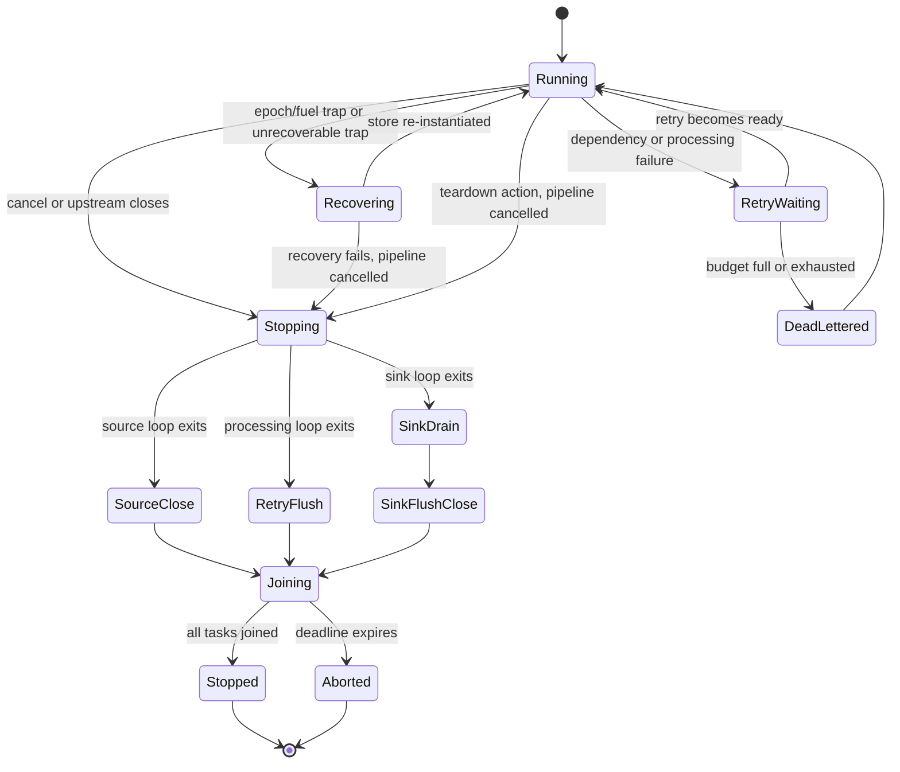

# Shutdown and failure behavior

> **Documentation type:** Explanation
>
> **Prerequisites:** [Tokio in WAFER's context](tokio-in-context.md), [Configuration to running pipeline](config-to-running-pipeline.md), [Follow one message through Wasm](message-through-wasm.md), and familiarity with [Result](rust-in-context.md#result), [RAII](rust-in-context.md#raii), and an [async function](rust-in-context.md#async-function).

## Purpose

This page explains what current runners do when input ends, cancellation arrives, a guest returns an error, a Wasm call traps, or tasks exceed the shutdown deadline. These paths share a cancellation token, but they do not form a single reverse-ordered shutdown algorithm.

## Flow

The diagram combines several node-local paths. It does not imply that every task visits every state or that cleanup occurs in the displayed vertical order.

### Natural completion

A finite source exits when `poll()` returns `Ok(None)`. `run_source_loop` (`crates/wafer-core/src/runner/source.rs`) then calls `source.close().await`. Returning from the source task drops its downstream senders. A transform or sink whose last sender disappears receives `None` and leaves its loop. A processing runner that still holds retries in backoff gives them their attempt first (`recv_next_or_retry` in `crates/wafer-core/src/runner/mod.rs`). This channel-close cascade lets `run_until_complete` (`crates/wafer-core/src/orchestrator/pipeline.rs`) finish when its `JoinSet` becomes empty.

### External cancellation

The runtime's signal thread (`spawn_shutdown_signal_thread` in `crates/wafer-runtime/src/main.rs`) and the control-plane `shutdown` handler (`crates/wafer-core/src/api/handlers.rs`) both cancel the orchestrator's shared `CancellationToken`. Every node bundle owns a child token, created in `build_pipeline_inner` (`crates/wafer-core/src/orchestrator/builder.rs`). Source, transform, and sink loops use biased `tokio::select!` branches while awaiting their native poll or queue receive operation.

A transform already executing guest code does not observe cancellation during that call. The guest call runs outside `select!` and completes before the runner reaches its next cancellation check. This protects the Wasmtime `Store` from being abandoned midway through an asynchronous cancellation race.

The orchestrator joins whichever task completes next until the deadline; it does not shut nodes down in reverse topological order. Both `shutdown` and the cancellation branch of `run_until_complete` use this bounded join pattern. If the deadline expires, `abort_stuck_tasks` calls `self.tasks.shutdown().await`, which aborts the tasks still held by the `JoinSet`.

### Node-local cleanup

Cleanup differs by runner:

- The source loop calls `source.close().await` after cancellation, EOF, or its exit path.
- Transform, filter, and router loops call `policy.flush_to_dlq(&DlqReason::Shutdown, &metrics)` whenever their loop exits, moving buffered retries to the DLQ path when a sender is available.
- The sink loop (`run_sink_loop` in `crates/wafer-core/src/runner/sink.rs`) exits its receive phase, uses `receiver.try_recv()` to consume messages already buffered, then calls `sink.flush().await` and `sink.close().await` even if collection during the drain reported an error.
- The DLQ task (`run_dlq_sink` in `crates/wafer-core/src/orchestrator/pipeline.rs`) takes no cancellation token. It keeps writing until every DLQ sender is dropped, which happens only after every node holding one has exited, so the retries that nodes flush on their way out still reach it. `run_until_complete` waits up to 5 s for it after the node tasks are joined.

A sink drains envelopes already buffered in its receiver, but the bounded orchestrator deadline means shutdown does not guarantee that every in-flight message completes. A message still executing in another node, waiting for queue capacity, or held in an aborted task can remain unfinished when the deadline expires.

### Guest errors and traps

WIT defines five process-error categories. `ErrorPolicyExecutor::handle` (`crates/wafer-core/src/runner/error_policy.rs`) decides the first four. The runners catch `unrecoverable` and traps other than epoch or fuel timeouts before they call `handle`:

| Category | Current behavior |
|---|---|
| `bad-input` | Apply the configured simple action: skip, DLQ, or teardown. |
| `dependency-failed` | Add to the bounded retry buffer with exponential backoff capped at 30 s (`MAX_BACKOFF_MS`), or apply its configured exhausted action. A full buffer sends the message to the DLQ as `RetryBufferFull`. |
| `processing-failed` | Use the same bounded retry and terminal-action path. |
| `timed-out` | Apply the configured `timed_out` simple action. |
| `unrecoverable` | The runner matches it before `handle` and recovers the instance, as described below. `handle` itself would return `Teardown`. |

The runners give ready retries priority over fresh messages and wake at the earliest due deadline even when upstream is idle. Retry count survives requeue. Once exhausted, `skip`, `dlq`, or `teardown` is honored; DLQ-full and DLQ-closed remain distinct outcomes and the envelope is not requeued. Transform preserves a safety clone before calling Wasm. Pending retries are flushed to the DLQ with a reason that says why: `HotSwapDrain` after a replacement is adopted (a failed swap keeps them), `RecoveryFailed` when recovery fails, and `Shutdown` whenever the loop exits.

Wasmtime traps and host failures during the call become `Trapped`, which keeps the wasmtime trap code when there is one. An epoch interruption or fuel exhaustion is a timeout: the `timed_out` action applies, then the store is recreated when policy permits (`recover_after_timeout` in `crates/wafer-core/src/runner/transform.rs`). Inside a transform's hot-swap canary window it counts as a trap instead. For any other trap, and a plugin-returned `unrecoverable`, a transform first uses the bounded canary rollback path when one is active, which replays the message on the restored version. Otherwise, or if the rollback fails, `record_condemned` sends the message to the DLQ as `Trapped { kind }` or `Unrecoverable`, or counts it as `dropped_on_recovery` when no DLQ is configured, and the runner re-instantiates from the cached pre-instantiated component (`recover_from_cached_pre`). If recovery fails, the runner returns an error, which ends the whole run (see the next section). A plugin-returned `timed-out` only applies the `timed_out` action; its instance is kept.

### Task and process results

`run_until_complete` records each node task that panicked, returned an error (for example a source or sink `init()` failure), or had to be aborted at the deadline, plus a failed or stuck DLQ task. After joining node tasks and waiting up to 5 s for the DLQ task, it returns one error naming every failure. The runtime logs that error, finishes its benchmark/control-plane cleanup so artifacts are written, and then exits with status 3 (`EXIT_PIPELINE_FAILED` in `crates/wafer-runtime/src/main.rs`).

One failing processing node stops the whole pipeline. A runner torn down by its error policy or unable to recover returns `Err` (`policy_teardown` or `recovery_failed` in `crates/wafer-core/src/runner/mod.rs`). The orchestrator spawns every transform, filter, and router runner through `spawn_wasm_runner` (`crates/wafer-core/src/orchestrator/pipeline.rs`), which cancels the pipeline token when its runner returns `Err`. The other nodes then shut down cooperatively as described above. A source or sink `init()` failure cancels the token the same way, through `fail_io_init`. A source that stops after 20 consecutive poll errors also fails the run, but it does not cancel the token: its downstream channels close instead.

The `shutdown` method cancels the token and then calls `run_until_complete`, so both entry points report failures the same way.

## Rust

[Tokio in context](tokio-in-context.md) explains the `CancellationToken`, `select!`, and `JoinSet` behavior these paths rely on: cancellation only wakes the `cancelled()` branch of each loop's `select!`, guest calls stay outside that macro, and only `JoinSet::shutdown` at the deadline aborts a task.

### `Result` carries a node failure to the orchestrator

`ErrorPolicyExecutor::handle` returns a typed `ErrorPolicyAction`. The shared runner helper `continue_after_policy_action` (`crates/wafer-core/src/runner/mod.rs`) turns each outcome into one counter increment (`retries`, `dlq_sent`, `skipped`, `retry_exhausted_skips`, `dlq_lost`, or `dropped_on_teardown`) and returns false only for `Teardown`. Every caller then leaves its loop with `Err(policy_teardown())`, and `spawn_wasm_runner` turns that `Err` into a pipeline-wide cancellation. The configurable `teardown` action therefore ends the run; it is not recovery. Within a processing runner, only the built-in trap and `unrecoverable` path calls `transition_to_error`, `transition_to_recovering` (`NodeStateTracker` in `crates/wafer-core/src/node/state.rs`), and `recover_from_cached_pre`.

## Design

Shutdown has two layers:

1. cooperative node behavior, where cancellation or channel closure leads to source close, retry flush, sink drain, sink flush, and sink close;
2. bounded orchestration, where the `JoinSet` gets a fixed window before remaining tasks are aborted.

This makes shutdown finite even if an adapter or task fails to cooperate. The trade-off is that "graceful" describes attempted cleanup, not guaranteed completion of all messages.

The window is 5 s (`SHUTDOWN_TIMEOUT`). `JoinSet::shutdown` cannot stop a guest that is still running with no fuel or epoch limit, so the runtime binary also exits at once, with status 143 or 130, on a second SIGTERM or SIGINT. Its signal listener runs on a dedicated thread with its own Tokio runtime, because a spinning guest can starve the main runtime's drivers.

Failure handling is similarly layered. WIT errors are typed data processed by `ErrorPolicyExecutor`; Wasmtime traps can require store recovery; task panics are observed at the orchestrator boundary. Keeping those categories separate avoids treating every guest failure as either a process crash or a retryable record.

## Status boundaries

**Current implementation:** Cancellation is broadcast to node tasks; cancellable waits leave their loops; active Wasm calls complete before observing cancellation; sinks drain their current receiver buffers and then flush and close; the DLQ task drains until its last sender is gone; a teardown or failed recovery cancels the whole pipeline; the orchestrator aborts remaining `JoinSet` tasks after its deadline.

**Intended design:** The combination of bounded retries, DLQ routing, store recovery, and cooperative cleanup aims to keep one bad message or guest instance from leaving the process indefinitely stuck.

**Known drift:** Shutdown is cancel-all, not reverse-topological, and does not prove completion of every in-flight message; only sinks drain their own buffered queue. The guest `close()` export is never called. A failed DLQ enqueue (full or closed sink) is counted as `dlq_lost` but cannot recover the message; the validator rejects a `dlq` action with no `[dead_letter]` sink. A `teardown` exit does not move the node's reported state to `Error`.

## Checkpoint

Explain three separate endings: natural channel closure, cooperative cancellation, and deadline-driven task abort. Then identify what each node type cleans up, why a running guest call is not cancelled, and where a typed guest error becomes a retry, DLQ entry, recovery attempt, or pipeline-wide shutdown.
