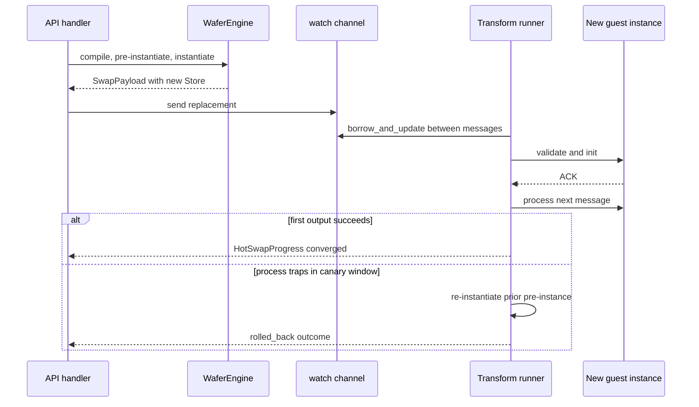

# Trace a stateless hot-swap

> **Documentation type:** Tutorial
>
> **Prerequisites:** [Cross the plugin boundary](plugin-boundary.md) and [Shutdown and failure behavior](shutdown-and-failure.md).

## Purpose

Follow replacement preparation, watch-channel delivery, between-message application, completion reporting, and the bounded process-time recovery path. The walkthrough distinguishes behavior proved by source and tests from broader rollback designs.

## Prerequisites

Use a Transform node for the complete walkthrough because current process-time rollback is implemented there. Filter and Router have prepared replacement payloads and between-message application, but the transform runner owns the canary rollback logic described below. This walkthrough follows source at commit `fa149e75d8b47e3284a76c9b98d0709e7e6f061c`.

## Flow

1. During pipeline construction, each Transform, Filter, and Router bundle receives `watch::channel(None)`. Sources and sinks receive no swap channel.
2. The API acquires a per-node swap guard, reads replacement bytes, and selects the preparation function for the node category. `prepare_transform_swap_timed` compiles through the engine cache, pre-instantiates the typed world, creates a new Store and bindings, and packages them in `SwapPayload::Transform` with `HotSwapProgress`.
3. `PipelineHandle::send_swap` publishes the payload through the node's watch sender. The transform runner polls `swap_rx.has_changed()` before selecting another message, so replacement happens between guest calls rather than by cancelling one.
4. `SwapPayload::try_apply_transform` takes ownership of the prepared Store and bindings. `WasmTransformNode::try_hot_swap` temporarily retains the old Store, bindings, and pre-instance, runs the replacement's `validate_and_init`, and keeps the old values only if that initialization fails.
5. On success, the runner marks ACK, records a swap, and retains the prior `InstancePre` during a bounded canary window. The first successful output completes `HotSwapProgress`.
6. If the new transform traps while that canary is active, the runner restores the prior cached pre-instance and calls `transform.recover_from_cached_pre()`. This creates another fresh Store, re-instantiates prior code, runs lifecycle initialization, retries the trapped envelope, and records recovery and rollback metrics. It reports a `rolled_back` API outcome only while the caller is still waiting; a rollback after an earlier successful output cannot replace the completed `swap_converged` response.

## Rust

A Tokio watch channel stores the latest `Option<SwapPayload>`. The payload is cloneable because the single-consumer Store and binding values sit in `Arc<Mutex<Option<T>>>`; `Option::take` transfers each prepared value exactly once into the owning runner task.

The live node is not shared behind a hot-path mutex. The runner owns it. `std::mem::replace` provides an initialization-failure transaction: the candidate becomes active for validation, and the old host objects can be put back if validation or initialization fails.

`HotSwapProgress` combines `OnceLock` timestamps with a oneshot result. ACK alone is not convergence. Successful output supplies the second marker. Before the first successful post-swap result consumes the progress sender, a process-time rollback completes the pending caller with an explicit `rolled_back` error outcome. After a successful result has already reported `swap_converged`, a later canary rollback cannot rewrite that completed response; recovery state and metrics are then the remaining record.

## Design

Hot-swap is stateless replacement. Mutable guest state is lost whenever a new Store and instance replace the old ones. The prior `InstancePre` retained for process-time rollback contains reusable compiled and linked code, not a snapshot of guest memory, globals, handles, or thread-local plugin state.

There are two different failure behaviors. Failed `validate` or `init` restores the still-retained old Store and bindings inside `try_hot_swap`. A later transform `process` trap invokes configured canary recovery by instantiating the prior pre-instance into a fresh Store. Neither path retains mutable state from the discarded guest instance.

The documented node-state tracker has Error, Recovering, and Running transitions during process-time recovery. There is no separate rollback node-state transition. Do not invent one from the `rolled_back` API status or rollback metric.

## Status boundaries

**Current implementation:** Watch senders exist for configured processing categories; replacement payloads are prepared for Transform, Filter, and Router; runner loops apply them between messages. The transform runner additionally implements configured canary recovery and reports ACK, first output, rollback, recovery, and phase observations.

**Intended design:** The API and metrics divide preparation, signal, ACK, convergence, and recovery so disruption can be measured without claiming that any one timestamp is the complete user-visible pause.

**Known drift:** Current builder comments call every configured processing category a Wasm node even though Transform and Filter can select native baseline functions. Those native variants reject a Wasm swap. Also, only the transform runner establishes process-time canary rollback; do not generalize it to Filter or Router. The integration tests are conditional on prebuilt component fixtures.

## Evidence

- **Source:** [`crates/wafer-core/src/orchestrator/builder.rs`](../../crates/wafer-core/src/orchestrator/builder.rs) | symbols: `watch::channel(None)`, `watch_senders.insert`
- **Source:** [`crates/wafer-core/src/orchestrator/hotswap.rs`](../../crates/wafer-core/src/orchestrator/hotswap.rs) | symbols: `pub async fn prepare_transform_swap_timed`, `SwapPayload::Transform`
- **Source:** [`crates/wafer-core/src/orchestrator/pipeline.rs`](../../crates/wafer-core/src/orchestrator/pipeline.rs) | symbols: `pub fn send_swap`, `pub fn record_hotswap_phase`
- **Source:** [`crates/wafer-core/src/runner/mod.rs`](../../crates/wafer-core/src/runner/mod.rs) | symbols: `pub struct HotSwapProgress`, `pub fn report_rolled_back`, `pub enum SwapPayload`
- **Source:** [`crates/wafer-core/src/runner/transform.rs`](../../crates/wafer-core/src/runner/transform.rs) | symbols: `swap_rx.has_changed()`, `transform.recover_from_cached_pre()`, `metrics.record_rollback()`
- **Source:** [`crates/wafer-core/src/node/wasm.rs`](../../crates/wafer-core/src/node/wasm.rs) | symbols: `pub fn try_hot_swap`, `self.store = old_store`, `pub fn recover_from_cached_pre`
- **Source:** [`crates/wafer-core/src/node/metrics.rs`](../../crates/wafer-core/src/node/metrics.rs) | symbols: `pub fn record_swap`, `pub fn record_rollback`, `pub fn record_recovery`
- **Source:** [`crates/wafer-core/src/api/handlers.rs`](../../crates/wafer-core/src/api/handlers.rs) | symbols: `pub async fn hot_swap`, `"status": "rolled_back"`, `"status": "swap_converged"`
- **Test:** [`crates/wafer-core/tests/hotswap_process_time_rollback.rs`](../../crates/wafer-core/tests/hotswap_process_time_rollback.rs) | symbols: `async fn hotswap_process_time_rollback()`, `async fn hotswap_bounded_rollback_thrash()`

## Checkpoint

Locate the point where `swap_rx.has_changed()` is checked. List what a full replacement transfers, what survives only as reusable host-side code/configuration, and what mutable guest state disappears. Finally, explain why `rolled_back` is an API outcome rather than a new `NodeState` variant.
