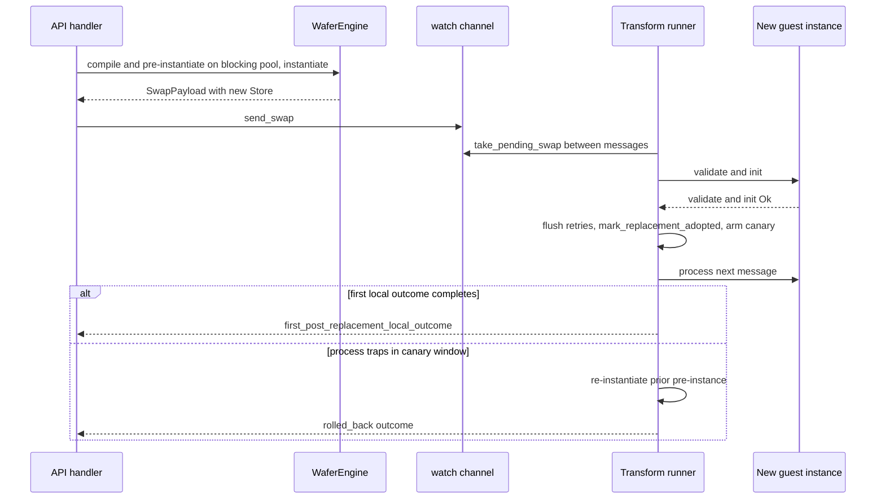

# Trace a stateless hot-swap

> **Documentation type:** Tutorial
>
> **Prerequisites:** [Cross the plugin boundary](plugin-boundary.md) and [Shutdown and failure behavior](shutdown-and-failure.md).

## Purpose

Follow replacement preparation, watch-channel delivery, between-message application, completion reporting, and the bounded process-time recovery path. The walkthrough distinguishes behavior proved by source and tests from broader rollback designs.

## Prerequisites

Use a Transform node for the complete walkthrough because current process-time rollback is implemented there. Filter and Router support replacement and between-message application, but the Transform runner owns the canary rollback logic below.

## Flow

1. During pipeline construction (`build_pipeline_inner` in `crates/wafer-core/src/orchestrator/builder.rs`), each Transform, Filter, and Router bundle receives `watch::channel(None)`. Sources and sinks receive no swap channel.
2. `POST /api/v1/nodes/{id}/hot-swap` reaches the `hot_swap` handler (`crates/wafer-core/src/api/handlers.rs`). It takes the per-node swap guard with `PipelineHandle::try_begin_swap` (`crates/wafer-core/src/orchestrator/pipeline.rs`), reads the replacement bytes, and selects the preparation function for the node category. For a Transform it calls `prepare_transform_swap_timed_with_fuel` (`crates/wafer-core/src/orchestrator/hotswap.rs`) with the node's effective fuel budget. That function compiles through the engine cache and pre-instantiates the typed world on Tokio's blocking pool (`compile_and_link`, which uses `spawn_blocking`), then creates a new Store and bindings and packages them in `SwapPayload::Transform` with `HotSwapProgress`.
3. `PipelineHandle::send_swap` publishes the payload through the node's watch sender. At the top of each iteration the transform runner calls `take_pending_swap` (`crates/wafer-core/src/runner/mod.rs`), which checks `swap_rx.has_changed()` before another message is selected, and its input wait also wakes on `swap_rx.changed()`, so an idle node swaps at once. Replacement happens between guest calls rather than by cancelling one. `take_pending_swap` also claims the payload with `HotSwapProgress::try_claim`. If the handler's 5 s wait for an outcome ends before that claim, the handler withdraws the payload with `try_withdraw` and answers 504, and the runner then ignores it.
4. `SwapPayload::try_apply_transform` takes ownership of the prepared Store and bindings. `WasmTransformNode::try_hot_swap` (`crates/wafer-core/src/node/wasm.rs`) rejects a replacement whose capabilities or inference grant differ from the running node. It then temporarily retains the old Store, bindings, and pre-instance, runs the replacement's `validate_and_init`, and keeps the old values only if that initialization fails.
5. When that returns `Ok`, the runner (`run_transform_loop_with_config` in `crates/wafer-core/src/runner/transform.rs`) flushes pending retries to the DLQ with `DlqReason::HotSwapDrain`, calls `mark_replacement_adopted`, records a swap, and retains the prior `InstancePre` in a canary. A failed swap keeps the old instance and its retries. The canary closes after `engine.hot_swap.canary_success_count` successful calls (default 32) or `canary_window_ms` (default 10000 ms), whichever comes first (`HotSwapConfig` in `crates/wafer-types/src/config/engine.rs`); the runner checks this at the top of each iteration. The first forwarded/enqueued, filter-dropped, or router-dropped result completes `first_post_replacement_local_outcome`. A reconfigure uses the same watch channel and guard but never arms a canary.
6. If the new Transform traps while that canary is active (including an epoch or fuel trap), the runner restores the prior cached pre-instance and calls `transform.recover_from_cached_pre()`. This creates another fresh Store, re-instantiates prior code, runs lifecycle initialization, retries the trapped envelope, and records recovery and rollback metrics. The canary is consumed by the rollback, so each swap rolls back at most once; a later trap in the restored version takes the ordinary recovery path. It reports `rolled_back` only while the caller is waiting; a later rollback cannot rewrite an already completed local-outcome response.

## Rust

[Tokio in context](tokio-in-context.md) covers the `watch`, `oneshot`, and `Notify` APIs used here. A Tokio watch channel stores the latest `Option<SwapPayload>`. The payload is cloneable because the single-consumer Store and binding values sit in `Arc<Mutex<Option<T>>>`; `Option::take` transfers each prepared value exactly once into the owning runner task.

The live node is not shared behind a hot-path mutex. The runner owns it. `std::mem::replace` provides an initialization-failure transaction: the candidate becomes active for validation, and the old host objects can be put back if validation or initialization fails.

`HotSwapProgress` (`crates/wafer-core/src/runner/mod.rs`) combines `OnceLock` timestamps with a oneshot result, plus an `AtomicU8` whose compare-exchange lets exactly one side win: the runner's claim or the API's withdrawal. Adoption alone does not complete the response. The first runner-local outcome supplies the second marker. Before that marker consumes the sender, a process-time rollback completes the pending caller with `rolled_back`. After a successful local outcome has already returned, a later canary rollback cannot rewrite the response; recovery state and metrics are then the remaining local record.

## Design

Hot-swap is stateless replacement. Mutable guest state is lost whenever a new Store and instance replace the old ones, and the replacement starts from its own `init`. The host never calls the outgoing guest's `close` export: the old Store is simply dropped, so a plugin cannot rely on `close` to flush or hand over state. The prior `InstancePre` retained for process-time rollback contains reusable compiled and linked code, not a snapshot of guest memory, globals, handles, or thread-local plugin state.

There are two different failure behaviors. Failed `validate` or `init` restores the still-retained old Store and bindings inside `try_hot_swap`. A later transform `process` trap invokes configured canary recovery by instantiating the prior pre-instance into a fresh Store. Neither path retains mutable state from the discarded guest instance.

The documented node-state tracker has Error, Recovering, and Running transitions during process-time recovery. There is no separate rollback node-state transition. Do not invent one from the `rolled_back` API status or rollback metric.

## Status boundaries

**Current implementation:** Every Transform, Filter, and Router has a watch sender, but only loaded Wasm processing nodes are marked replacement-eligible; replacement payloads are prepared for Transform, Filter, and Router; runner loops apply them between messages. The Transform runner additionally implements configured canary recovery. Hot-swap and reconfigure share one per-node mutation guard.

**Intended design:** The API and metrics divide preparation, signal, replacement adoption, first runner-local outcome, rollback, and recovery so each claim has one owner. None is sink evidence; sink transition, sequence continuity, loss, throughput, and gap require evaluation artifacts.

**Known drift:** The guest `close` export is not called on replacement, recovery, or shutdown. Current builder comments call every configured processing category a Wasm node even though Transform and Filter can select native baseline functions. Those native variants reject a Wasm swap. Also, only the transform runner establishes process-time canary rollback; do not generalize it to Filter or Router. The integration tests are conditional on prebuilt component fixtures.

## Checkpoint

Locate the point where `take_pending_swap` checks `swap_rx.has_changed()`. List what a full replacement transfers, what survives only as reusable host-side code/configuration, and what mutable guest state disappears. Finally, explain why `rolled_back` is an API outcome rather than a new `NodeState` variant.
