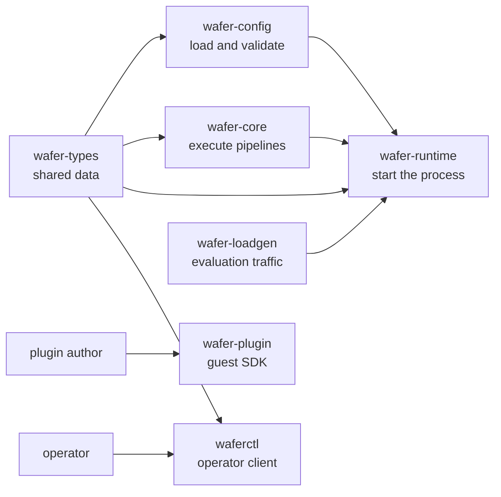

# Workspace and ownership map

> **Documentation type:** Explanation
>
> **Prerequisites:** [Learning guide orientation](README.md)

## Purpose

The workspace has seven crates. Their boundaries answer a practical maintenance question: where should a change begin? Shared data belongs in `wafer-types`; parsing and topology validation belong in `wafer-config`; execution belongs in `wafer-core`; binaries compose those libraries at process boundaries.

## Flow

The arrows show compile-time or operational use, not a complete Cargo dependency graph. In particular, `wafer-plugin` is compiled into guest components; `wafer-core` does not depend on it.

## The seven owners

| Crate | Target | Owns | Start reading |
|---|---|---|---|
| `wafer-types` | library | Shared configuration, control-plane, event, and metric data types | [`crates/wafer-types/src/lib.rs`](../../crates/wafer-types/src/lib.rs), then [`config/mod.rs`](../../crates/wafer-types/src/config/mod.rs) |
| `wafer-config` | library | TOML loading, semantic validation, and standalone DAG construction | [`crates/wafer-config/src/lib.rs`](../../crates/wafer-config/src/lib.rs) |
| `wafer-core` | library | Engine, native adapters, queue wiring, runners, orchestration, metrics, registry, and feature-gated HTTP API | [`crates/wafer-core/src/lib.rs`](../../crates/wafer-core/src/lib.rs) |
| `wafer-runtime` | binary named `wafer` | Process startup: CLI arguments, configuration, pipeline launch, control plane, signals, and evaluation hooks | [`crates/wafer-runtime/src/main.rs`](../../crates/wafer-runtime/src/main.rs) |
| `wafer-plugin` | library | Guest-side helper macros and optional JSON config parsing | [`crates/wafer-plugin/src/lib.rs`](../../crates/wafer-plugin/src/lib.rs) |
| `wafer-loadgen` | library and binary | MQTT load generation, subscription, latency recording, and summary machinery for evaluation | [`crates/wafer-loadgen/src/lib.rs`](../../crates/wafer-loadgen/src/lib.rs) |
| `waferctl` | binary | Operator CLI, HTTP client calls, endpoint configuration, and output formatting | [`crates/waferctl/src/main.rs`](../../crates/waferctl/src/main.rs) |

The root [`Cargo.toml`](../../Cargo.toml) is the authority for the seven workspace members. Each crate's own `Cargo.toml` identifies its target and direct dependencies.

## Rust

A [workspace](rust-in-context.md#workspace) groups packages under one dependency and lint configuration. Each package here provides one or more compilation units called a [crate](rust-in-context.md#crate): a library, a binary, or both. This is why `wafer-loadgen` can expose reusable measurement code from `src/lib.rs` while retaining a CLI in `src/main.rs`.

`wafer-config/src/lib.rs` demonstrates a [public re-export](rust-in-context.md#public-re-export). Its implementation stays split into private modules, while callers import `wafer_config::load_config`, `wafer_config::validate`, and `wafer_config::DagGraph` from one narrow surface.

## Design

The deepest seam is between data, interpretation, and execution:

1. `wafer-types` describes a `Config` without reading files or starting tasks.
2. `wafer-config` turns TOML into that type and rejects semantic mistakes.
3. `wafer-core` consumes the typed model to build queues, nodes, and supervision state.
4. `wafer-runtime` selects command-line inputs and starts the core pipeline.

The remaining crates have one clear consumer boundary: guest authors use `wafer-plugin`, evaluation tooling uses `wafer-loadgen`, and operators use `waferctl`.

### Change-placement checks

- A new configuration field begins in `wafer-types`, gains semantic checks in `wafer-config` when needed, and is consumed in `wafer-core` or the runtime binary.
- A new runner behavior belongs in `wafer-core`.
- A new runtime startup flag belongs in `wafer-runtime`; a new operator command belongs in `waferctl`.
- A helper used inside guest components belongs in `wafer-plugin`, but a WIT contract change belongs under `wit/` and requires host and guest updates.

## Status boundaries

**Current implementation:** The root workspace lists exactly seven members. `wafer-config` owns `load_config`, `validate`, and `DagGraph`; the runtime imports `load_config` and `validate` before launching the pipeline.

**Intended design:** Placing shared types below parsing and execution is the organizing rationale visible in crate descriptions and dependencies. That rationale does not guarantee every module or binary is small.

**Known drift:** `docs/status/implementation-status.md` says `wafer-config` owns "Types + validator," but current source places the configuration types in `wafer-types`. Treat the source split above as authoritative. The core also contains a `dag` module used by orchestration, so `wafer-config::DagGraph` is not the only graph representation in the repository.

## Checkpoint

Without opening implementation details, name the owner for a new config field, a queue-runner change, a plugin helper, a benchmark traffic change, a runtime flag, and an operator command. If any answer is unclear, follow that crate's `src/lib.rs` or `src/main.rs` before moving on.
