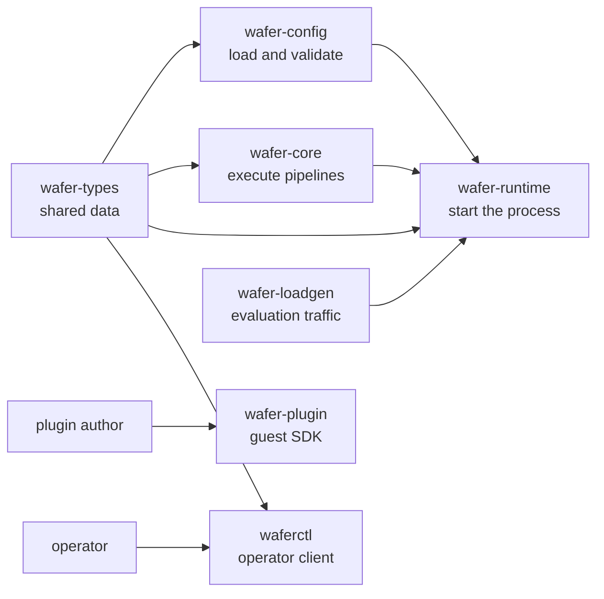

# Workspace and ownership map

> **Documentation type:** Explanation
>
> **Prerequisites:** [Learning guide orientation](README.md).

## Purpose

The workspace has seven crates. Their boundaries answer a practical maintenance question: where should a change begin? Shared data belongs in `wafer-types`; parsing and topology validation belong in `wafer-config`; execution belongs in `wafer-core`; binaries compose those libraries at process boundaries.

## Flow



The arrows show compile-time or operational use, not a complete Cargo dependency graph. In particular, `wafer-plugin` is compiled into guest components; `wafer-core` does not depend on it.

## The seven owners

| Crate | Target | Owns | Start reading |
|---|---|---|---|
| `wafer-types` | library | Shared configuration, control-plane, event, and metric data types | [`crates/wafer-types/src/lib.rs`](../../crates/wafer-types/src/lib.rs), then [`config/mod.rs`](../../crates/wafer-types/src/config/mod.rs) |
| `wafer-config` | library | TOML loading, semantic validation, and standalone DAG construction | [`crates/wafer-config/src/lib.rs`](../../crates/wafer-config/src/lib.rs) |
| `wafer-core` | library | Engine, native adapters, queue wiring, runners, orchestration, metrics, registry, and feature-gated HTTP API | [`crates/wafer-core/src/lib.rs`](../../crates/wafer-core/src/lib.rs) |
| `wafer-runtime` | binary named `wafer` | Process startup: CLI arguments, configuration, pipeline launch, control plane, signals, and evaluation hooks | [`crates/wafer-runtime/src/main.rs`](../../crates/wafer-runtime/src/main.rs) |
| `wafer-plugin` | library | Guest-side helper macros and optional JSON config parsing | [`crates/wafer-plugin/src/lib.rs`](../../crates/wafer-plugin/src/lib.rs) |
| `wafer-loadgen` | library and binary | MQTT load generation, subscription, latency recording, and summary machinery for evaluation | [`crates/wafer-loadgen/src/lib.rs`](../../crates/wafer-loadgen/src/lib.rs) |
| `waferctl` | binary | Operator CLI, HTTP client calls, endpoint configuration, and output formatting | [`crates/waferctl/src/main.rs`](../../crates/waferctl/src/main.rs) |

The root [`Cargo.toml`](../../Cargo.toml) is the authority for the seven workspace members. Each crate's own `Cargo.toml` identifies its target and direct dependencies.

## Rust

A [workspace](rust-in-context.md#workspace) groups packages under one dependency and lint configuration. Each package here provides one or more compilation units called a [crate](rust-in-context.md#crate): a library, a binary, or both. This is why `wafer-loadgen` can expose reusable measurement code from `src/lib.rs` while retaining a CLI in `src/main.rs`.

`wafer-config/src/lib.rs` demonstrates a [public re-export](rust-in-context.md#public-re-export). Its implementation stays split into private modules, while callers import `wafer_config::load_config`, `wafer_config::validate`, and `wafer_config::DagGraph` from one narrow surface.

## Design

The deepest seam is between data, interpretation, and execution:

1. `wafer-types` describes a `Config` without reading files or starting tasks.
2. `wafer-config` turns TOML into that type and rejects semantic mistakes.
3. `wafer-core` consumes the typed model to build queues, nodes, and supervision state.
4. `wafer-runtime` selects command-line inputs and starts the core pipeline.

The remaining crates have one clear consumer boundary: guest authors use `wafer-plugin`, evaluation tooling uses `wafer-loadgen`, and operators use `waferctl`.

### Change-placement checks

- A new configuration field begins in `wafer-types`, gains semantic checks in `wafer-config` when needed, and is consumed in `wafer-core` or the runtime binary.
- A new runner behavior belongs in `wafer-core`.
- A new runtime startup flag belongs in `wafer-runtime`; a new operator command belongs in `waferctl`.
- A helper used inside guest components belongs in `wafer-plugin`, but a WIT contract change belongs under `wit/` and requires host and guest updates.

## Inside wafer-core

`wafer-core` is the largest crate. `crates/wafer-core/src/lib.rs` declares its top-level modules; this table gives each one's job and the names to search for first.

| Module | Owns | Start with |
|---|---|---|
| `orchestrator` | Startup and the running pipeline: `launcher.rs` loads plugins and builds adapters, `builder.rs` wires queues and node bundles, `pipeline.rs` spawns and supervises tasks, `hotswap.rs` prepares replacements | `launch_pipeline_timed`, `build_pipeline`, `NodeBundleKind`, `PipelineOrchestrator`, `PipelineHandle` |
| `runner` | One loop per role in `source.rs`, `transform.rs`, `filter.rs`, `router.rs`, and `sink.rs`; the send path and hot-swap payloads in `mod.rs`; retry, skip, dead-letter, and teardown decisions in `error_policy.rs` | `run_transform_loop`, `send_one`, `DownstreamSender`, `SwapPayload`, `ErrorPolicyExecutor` |
| `node` | The node types the runners drive: Wasm processing nodes in `wasm.rs`, native adapters in `source/` and `sink/`, native baseline functions in `native/`, and per-node counters and state | `WasmTransformNode`, `TransformNode`, `FilterNode`, `Source`, `Sink`, `NodeMetrics`, `NodeStateTracker` |
| `engine` | Wasmtime integration: the engine and epoch ticker in `loader.rs`, generated bindings in `bindings.rs`, per-Store host state, the buffer resource, the compiled-component cache, capabilities, and outbound HTTP checks | `WaferEngine`, `WaferState`, `WaferBuffer`, `ComponentCache`, `Capabilities` |
| `queue` | The message type in `envelope.rs` | `RuntimeEnvelope`, `EnvelopeHeader` |
| `registry` | Resolving a plugin reference, either a local path or an OCI reference, to component bytes; OCI downloads are cached on disk | `WaferRegistry::resolve`, `PluginSource`, `PackageCache` |
| `api` | HTTP control plane and metrics server, compiled only with the `http-api` feature | `ApiServer`, `MetricsServer`, the handlers in `handlers.rs` |
| `metrics` | Hot-swap phase histograms rendered by the `/metrics` handler | `HotSwapMetrics`, `PhaseHistogram` |
| `bench` | Memory and queue-depth samplers for evaluation runs | `MemoryRecorder`, `QueueDepthRecorder` |
| `dag` | A structural check at build time: no empty pipeline, no unknown edge endpoint, no cycle | `DagGraph::from_config` |
| `dlq` | The JSON form of a dead-lettered envelope | `SerializableEnvelope` |
| `config` | A re-export of `wafer_types::config` plus default constants | `DEFAULT_QUEUE_CAPACITY` |
| `error` | The core error enum and its `Result` alias | `WaferError` |
| `testing` | Channel-backed source and sink, the plugin test harness, and `artifact_available`; compiled for tests or with `test-support` | `ChannelSource`, `ChannelSink`, `PluginTestHarness` |
| `util` | Saturating time conversions and the monotonic clock behind timestamps | `duration_ns_saturating` |

Some public items are not on the runtime path. `queue::BoundedQueue` is used only by `crates/wafer-core/benches/throughput.rs`. The runtime's dead-letter types are `DlqEnvelope` and `DlqReason` in `crates/wafer-core/src/runner/error_policy.rs`, not the same-named types or `wrap_for_dlq` in `dlq`. `node::AnyNode`, `node::WasmRouter`, and `engine::WasmBindings` have no caller outside their own files, `metrics::MetricsRegistry` is used only by `crates/wafer-core/benches/metrics.rs`, and `wafer_config::DagGraph` is called only by its own tests.

## Repository layout

| Path | What it holds |
|---|---|
| `crates/` | The seven workspace crates. Each crate's integration tests are in its own `tests/` directory; the criterion benchmarks are in `crates/wafer-core/benches/`. |
| `plugins/` | First-party guest components. Each Rust plugin is a separate Cargo package with an empty `[workspace]` table, its own `Cargo.lock`, `crate-type = ["cdylib"]`, and a `.cargo/config.toml` that sets the `wasm32-wasip2` target. The root manifest has `exclude = ["plugins/*"]`, so a root `cargo build` never builds them; `plugins/build-plugins.sh` does. `plugins/attacks/` holds the containment-attack plugins, and `plugins/go/` and `plugins/python/` hold non-Rust guests. |
| `wit/` | The `wafer:pipeline` WIT package, with pinned dependencies under `wit/deps/`. `crates/wafer-core/wit` is a symlink to `../../wit`: the host's `bindgen!` calls in `crates/wafer-core/src/engine/bindings.rs` use the crate-relative path `"wit"`, while a plugin such as `plugins/pass-through/src/lib.rs` passes `"../../wit"` to `wit_bindgen::generate!`. Both read the same files. |
| `examples/` | Runnable pipeline configurations, listed in `examples/README.md`. A relative plugin path in a config is resolved against the config file's directory. |
| `tests/fixtures/` | Shared configuration and data fixtures, such as the MNIST digit used by inference tests. |
| `eval/` | The evaluation harness: experiment configs in `eval/configs/`, run scripts in `eval/scripts/`, analysis in `eval/analysis/`, and the result-directory contract in `eval/RESULT-CONTRACT.md`. [From experiment definition to evidence](evaluation-harness.md) walks through it. |
| `scripts/` | Repository checks: `check-docs.sh` checks `crates/` paths and relative links in the docs, and `scripts/README.md` lists the rest. |
| `docs/` | Architecture views, interface references, operations guides, decision records (`adr/`, `rfcs/`), status pages, evaluation runbooks, this guide, and an archive in `history/`. [docs/README.md](../README.md) is the index. |
| `models/` | The ONNX model used by the MNIST inference plugin. |

## Features and toolchain

The root manifest depends on `wafer-core` with `default-features = false`, so each dependent crate picks its own [features](rust-in-context.md#cargo-feature).

| Feature | Declared in | Effect |
|---|---|---|
| `http-api` | `wafer-core`; on by default in `wafer-runtime` | Compiles the `api` module and pulls in `axum`, `tower-http`, `prometheus-client`, and `sysinfo` |
| `test-support` | `wafer-core` | Compiles the `testing` module for other crates; enabled through dev-dependencies |
| `ort-download` | `wafer-core` and `wafer-runtime`; on by default in both | Downloads the pinned ONNX Runtime at build time; `ORT_LIB_LOCATION` points the build at a local copy instead |
| `cuda` | `wafer-core` and `wafer-runtime` | Builds `wasmtime-wasi-nn` with CUDA support |

`rust-toolchain.toml` pins Rust 1.98.1 with `rustfmt`, `clippy`, and the `wasm32-wasip2` target. The workspace uses edition 2024. Wasmtime and its WASI crates come from one git revision pinned in the root `Cargo.toml`.

## Build, run, and test

The commands come from `mise.toml` and `plugins/mise.toml`. [Getting started](../operations/getting-started.md) covers installing the tools with `mise run setup`.

```bash
mise run build                                # cargo build --locked --workspace
mise run //plugins:build-plugin pass-through  # one plugin, for wasm32-wasip2
mise run //plugins:build-plugins              # every Rust plugin
echo "Hello World" | cargo run -p wafer-runtime -- --config examples/dag-passthrough.toml
mise run test                                 # builds every plugin, then cargo test --locked --workspace
mise run fmt                                  # cargo fmt --all
mise run clippy                               # cargo clippy --locked --workspace --all-targets --all-features
```

`mise run build` does not build plugins, because they are outside the workspace. Build the plugin an example names before running it; a plugin lands in `plugins/<name>/target/wasm32-wasip2/release/`. `mise run run` runs `examples/dag-passthrough.toml` when given no path.

Many tests that need a built plugin check for it with `artifact_available` in `crates/wafer-core/src/testing/mod.rs`. Under a plain `cargo test`, a missing plugin prints a `SKIP` line and the test returns early, so it reports `ok` without checking anything. `mise run test` builds every plugin first and runs the tests with `WAFER_REQUIRE_PLUGINS=1`, which turns a missing plugin into a failure. A few tests, such as `crates/wafer-core/tests/attack_containment.rs`, fail on a missing plugin in either mode.

## Status boundaries

**Current implementation:** The root workspace lists exactly seven members and excludes `plugins/*`. `wafer-config` owns `load_config`, `validate`, and `DagGraph`; the runtime imports `load_config` and `validate` before launching the pipeline.

**Intended design:** Placing shared types below parsing and execution is the organizing rationale visible in crate descriptions and dependencies. That rationale does not guarantee every module or binary is small.

**Known drift:** The core contains its own `dag` module, so `wafer-config::DagGraph` is not the only graph representation in the repository. `build_pipeline` uses the core `DagGraph` only to reject a bad topology: it stores the result in `BuildOutput` and nothing reads it again. Node bundles are built by iterating the `config.nodes` `HashMap`, so tasks start in hash-map order, not topological order.

## Checkpoint

Without opening implementation details, name the owner for a new config field, a queue-runner change, a plugin helper, a benchmark traffic change, a runtime flag, and an operator command. If any answer is unclear, follow that crate's `src/lib.rs` or `src/main.rs` before moving on. Then use the module table to name the file that handles a full destination queue and the file that decides whether a failed message is retried.
